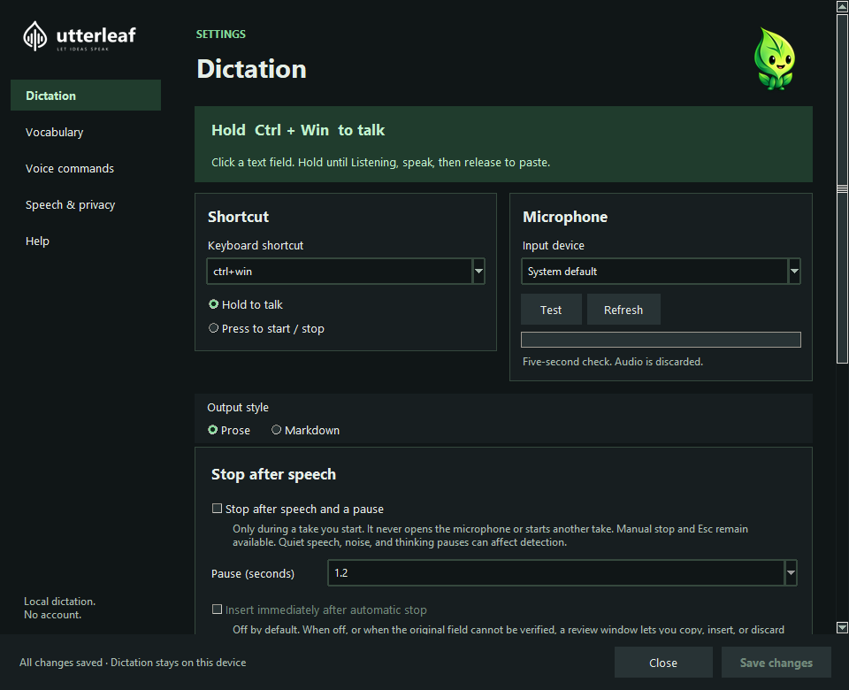

  <picture>
    <source media="(prefers-color-scheme: dark)" srcset="docs/assets/brand/wordmark-inverse.png" />
    
  </picture>

<strong>A little leaf. A lot less typing.</strong> Private, on-device dictation for Windows, macOS, and Linux, with an Android keyboard preview.

  <a href="#download"><strong>Download</strong></a> ·
  <a href="docs/user-guide.md">How to use it</a> ·
  <a href="docs/screenshots.md">Take a look</a> ·
  <a href="docs/README.md">Help & docs</a>

Speak into the app you're already using. Utterleaf turns your words into text,
then gets out of the way. No account, no cloud transcription, and no saved audio
history. Your microphone closes between takes.

## Desktop and Android

| Desktop dictation | Android keyboard preview |
| --- | --- |
|  |  |
| Hold a shortcut and speak naturally; the local result goes to your selected text field. | Type directly with the Android keyboard, then add optional offline English voice when you choose. |

The desktop capture is from the Windows app. The Android capture is a synthetic
editor on an API 35 emulator from alpha07, revision `ee47aa7`. [Android preview
and current limits](docs/mobile.md) · [Keyboard roadmap](docs/mobile-roadmap.md)

## Download

Desktop archives include Python. Extract the **whole archive**, then open Utterleaf.
On Android, install the signed APK and follow its keyboard setup.

| Your computer | Download | Setup |
| --- | --- | --- |
| Windows x64 | [Windows ZIP](https://github.com/RioPlay/utterleaf/releases/latest/download/Utterleaf-windows-x64-cpu.zip) | Open `Utterleaf/utterleaf.exe` |
| macOS Apple Silicon | [macOS archive](https://github.com/RioPlay/utterleaf/releases/latest/download/Utterleaf-macos-arm64.tar.gz) | [Permissions & launch](docs/installation.md#macos) |
| Linux x64 | [Linux archive](https://github.com/RioPlay/utterleaf/releases/latest/download/Utterleaf-linux-x64.tar.gz) | [X11 setup](docs/installation.md#linux) · [Wayland setup](docs/wayland.md) |
| Android ARM64 preview | [Signed Android alpha09 APK](https://github.com/RioPlay/utterleaf/releases/download/android-v0.1.0-alpha09/Utterleaf-Android-0.1.0-alpha09.apk) | [Setup & current limits](docs/mobile.md) |

Linux builds target Ubuntu 24.04 or compatible distributions. Downloads are
unsigned on desktop; the Android APK is signed. macOS is not notarized. Wayland needs manual shortcut/paste setup and
XWayland; native desktop dictation is still being validated.
[Release notes & checksums](https://github.com/RioPlay/utterleaf/releases/latest).

## Your first words on desktop

1. **Open Utterleaf.** The speech model downloads on first launch. Once installed,
   recognition works offline; you can disable further model downloads in Settings.
2. **Check your microphone.** Click the tray leaf, then **Test microphone**.
3. **Click a text field and speak.** Hold **Ctrl+Win** on Windows or
   **Ctrl+Shift+Space** on macOS/X11, wait for Listening or the start sound, and
   release when finished. Prefer a toggle? Choose **Press to start / stop**.
   On Wayland, use your configured desktop shortcut instead.

## Small touches that help

| Speak naturally | Make it yours | Find your way back |
| :--- | :--- | :--- |
|  |  |  |
| Say punctuation and bullet lists. Keep the desktop quiet, or enable a countdown and dictation preview. | Add names and phrases to your vocabulary. Turn cleanup off when you want the model transcript unchanged. | Copy the latest dictation within two minutes. Restore defaults without losing vocabulary, models, or privacy preferences. |
| [Dictation basics](docs/user-guide.md#dictate-and-recover-text) | [Voice commands](docs/user-guide.md#voice-commands) | [Settings & recovery](docs/user-guide.md#settings-and-recovery) |

## Know your leaf

The small leaf in your system tray shows what Utterleaf is doing. Click it to
open Settings; use the tray menu to copy or forget your latest dictation.

|  Ready |  Recording |  Processing |  Needs attention |
| --- | --- | --- | --- |
| Ready for a take | Capturing your voice | Loading or transcribing | Check the status message |

The dot, three dots, and exclamation mark help distinguish states without relying
only on color. Offline use is normal—not an error.
[Icon meanings & next steps](docs/status-guide.md).

Recognition runs locally. Recent output is held temporarily in memory; text you
copy may remain in your OS clipboard history. GPU acceleration needs compatible
CUDA libraries; the Windows download also works on CPU, and macOS currently uses
CPU inference. [Privacy & usage](docs/user-guide.md) · [GPU setup](docs/installation.md).

## Keep growing

[Roadmap](docs/roadmap.md) · [Contribute & build](docs/development.md) ·
[Desktop plan](docs/desktop-roadmap.md) · [Mobile plan](docs/mobile-roadmap.md) ·
[Mobile voice preview](docs/mobile.md) · [Ideas](docs/ideas.md) ·
[Platform testing](docs/platform-testing.md) · [Brand & artwork](docs/branding.md) ·
[Report a problem](https://github.com/RioPlay/utterleaf/issues)

Utterleaf is [Apache-2.0 licensed](LICENSE), © 2026 RioPlay. See [NOTICE](NOTICE)
for attribution. Downloads include third-party notices; model weights are separate.
