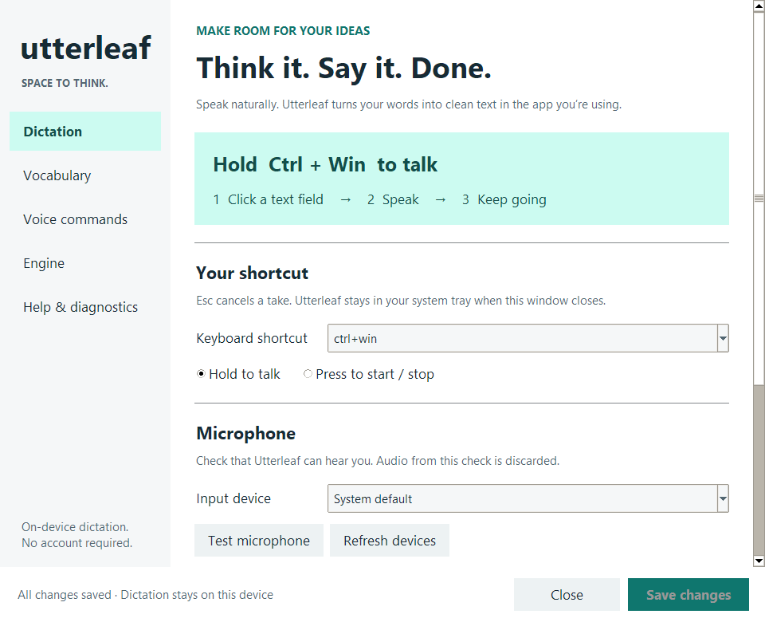

<p align="center">
  
</p>
<h1 align="center">Utterleaf</h1>
<p align="center"><strong>Let ideas speak.</strong><br />A little leaf. A quieter way to write.</p>
<p align="center">Private, on-device dictation for Windows, macOS, and Linux.<br />Speak naturally. Keep your words close.</p>
<p align="center">
  <a href="https://github.com/RioPlay/utterleaf/releases/latest"><strong>Download Utterleaf</strong></a>
  · <a href="#use-it">Get started</a>
  · <a href="docs/roadmap.md">What's growing next</a>
</p>

Hold a shortcut, speak, and release. Utterleaf turns your speech into text and
pastes it into the app you're using. It lives quietly in your system tray, with
a friendly leaf to tell you when it's listening.

| Your words stay yours | Less fuss, more writing | A little personality |
| --- | --- | --- |
| Local speech recognition. No account. No saved recording history. | Personal vocabulary, spoken punctuation, list formatting, and optional text cleanup. | Dark Settings, a quiet tray icon, and Utterling to help you find your way. |

The selected speech model downloads once, then recognition works offline.
NVIDIA acceleration requires compatible CUDA libraries; CPU works without them.

## A look inside


<p align="center"><em>Your shortcut, your microphone, your pace.</em></p>

| Words, your way | Let your voice do it |
| --- | --- |
|  |  |
| Teach Utterleaf names and phrases you use every day. | Find the commands for lists, corrections, and punctuation. |

Screenshots show the current development version on Windows, using sample
vocabulary. The latest downloadable release may look different; check its release notes.

## Use it

Utterleaf lives in the system tray as a green leaf. Click it to open Settings.

1. Hold the hotkey, wait for **Listening** or the start sound, talk, then release. Default is **Ctrl+Win** on Windows, **Ctrl+Shift+Space** on macOS and Linux.
2. The tray icon changes as it records and processes your words. The floating indicator is optional.
3. The sentence lands in the app you were already in. Esc cancels a take.

The microphone opens for a take and is released after its short ending buffer;
it is not kept listening while idle. Microphone checks in Settings open it only
for the check. Audio stays in memory for processing and is not saved as a
recording history. Takes stop automatically at 120 seconds by default, with a
notice to start another take. When enabled, the floating indicator shows the remaining time.
Up to four takes can wait behind a slow decode;
Utterleaf asks you to wait before accepting more.

If a result does not reach your text field, open the tray menu and choose
**Copy last dictation (2 min)**. Only the latest output is kept in this recovery
slot, in memory, for two minutes. **Forget last dictation** clears it and the
previous edit context immediately; quitting also clears it. Copying deliberately
puts the text on your system clipboard, where your OS clipboard history may
retain it. You can also bind a desktop shortcut to `utterleaf --copy-last` or
clear it with `utterleaf --forget-last`.

Click the tray icon (or right-click → **Settings…**) to open the Utterleaf control center. First launch opens it automatically.

- **Dictation:** choose your shortcut, hold or press mode, microphone, recording feedback, and start at login. A five-second microphone check shows input levels without saving audio.
- **Vocabulary:** add names and custom terms, choose text cleanup options, and preview the result on a sample before saving.
- **Voice commands:** browse the built-in editing and punctuation commands.
- **Speech & privacy:** choose a model, processing device, language, noise reduction, and clipboard behavior. Missing model downloads can be disabled.
- **Help:** check whether the app is running, generate a device report, and save it wherever you choose.

Meet **Utterling**, your leafy companion. You'll find it welcoming you in Dictation,
typing alongside Vocabulary, explaining Voice commands, and reacting to microphone
checks. All seven expressions are bundled locally—no extra downloads.

<p align="center">
  
  
  
</p>

Prefer a clear screen? **Tray icon only** is the default. Switch the overlay on
from the tray's **Floating indicator** toggle, or choose **Tray + floating indicator**
under Dictation → Recording feedback. Live captions only run when the overlay is visible.
Settings uses a dark theme by default. Native system dialogs follow the OS theme.

**Help → Icons & artwork** explains every icon and mascot, previews them on light
and dark surfaces, and exports a complete asset pack with transparent PNG cutouts.

The window resizes and scrolls, with Save always accessible. **Ctrl+S** (or **Command+S** on macOS) saves without closing; closing with unsaved changes asks before discarding them. Device checks run in the background.

On **Wayland**, Utterleaf disables global key listening. Bind a desktop shortcut to the absolute path of the executable followed by `--toggle`, for example `/home/you/Utterleaf/utterleaf --toggle`. Press once to record and again to transcribe. XWayland and a working `DISPLAY` are required for the current Tk/Xorg components. Install `wl-clipboard` and a compatible paste helper (`wtype` on supported compositors, or a configured `ydotool`); support varies by compositor. The shortcut must point to the same executable you launched.

On **macOS**, grant Microphone and Accessibility when asked. Without Accessibility, the hotkey and the paste both do nothing.

## Install

Binary releases are built for Windows 11 x64, macOS (Apple Silicon), and Linux x64 (Ubuntu 24.04 or compatible). You need a microphone and internet for the first model download; an NVIDIA GPU is optional. Extract the entire release archive, then open `Utterleaf\utterleaf.exe` on Windows or `./Utterleaf/utterleaf` on macOS/Linux. Keep the `_internal` folder beside the executables. Python is not needed for the binary release.

From PowerShell in the extracted `Utterleaf` folder:

```powershell
.\utterleaf-cli.exe --doctor
.\utterleaf-cli.exe --download-model
```

For source installs below, use [Python 3.10+](https://www.python.org/downloads/). CI uses Python 3.14 on Windows/macOS and Ubuntu's system Python on Linux; the instructions below are for source installs.

### Windows

```powershell
cd Utterleaf  # your cloned repository
python -m venv .venv
.\.venv\Scripts\python -m pip install -e ".[dev]"
Start-Process ".\.venv\Scripts\pythonw.exe" -ArgumentList "-m","utterleaf"
```

NVIDIA GPU (driver alone is not enough):

```powershell
.\.venv\Scripts\python -m pip install -e ".[cuda]"
```

For a packaged Windows build, open `utterleaf.exe` (or the compatibility entry `utterleafw.exe`). Both are windowless. `utterleaf-cli.exe` is only for terminal diagnostics. When developing from Python, use `pythonw.exe` for normal app launches; the `utterleaf` terminal command is for debugging.

### macOS

```bash
python3 -m venv .venv
.venv/bin/python -m pip install -e ".[dev]"
.venv/bin/python -m utterleaf
```

Use a Python build with Tk support. Current python.org macOS installers include it; Homebrew Python needs the matching `python-tk` package (for example `python-tk@3.14`). Grant Microphone and Accessibility the first time you record.

### Linux

Needs PortAudio and a paste helper (`wtype`, `xdotool`, or `ydotool`). Sounds use `paplay`, `aplay`, or `play`.

```bash
# Debian/Ubuntu
sudo apt install python3-venv portaudio19-dev python3-tk wtype wl-clipboard xclip xdotool
python3 -m venv .venv
.venv/bin/python -m pip install -e ".[dev]"
.venv/bin/python -m utterleaf
```

On Wayland use `wtype` with `wl-clipboard`. On X11 use `xdotool` with `xclip` for clipboard access. The tray icon uses StatusNotifierItem: KDE Plasma shows it natively, GNOME needs the AppIndicator extension. Source installs also need PyGObject and the Ayatana appindicator bindings (`sudo apt install gir1.2-ayatanaappindicator3-0.1` on Debian/Ubuntu); without them the tray falls back to the legacy X11 icon, which Wayland sessions do not display. `utterleaf --doctor` prints the backend it picked. NVIDIA:

```bash
.venv/bin/python -m pip install -e ".[cuda]"
```

A binary release on Linux uses the distro's NVIDIA toolkit instead: install `cuda` and `cudnn` for your distribution (Arch: `sudo pacman -S cuda cudnn`), or produce a self-contained CUDA build with `UTTERLEAF_BUNDLE_CUDA=1`.

Don't know the exact command for your distro? Run `utterleaf --cuda-setup` (or open **Settings → Help → Set up NVIDIA GPU…**) for steps matched to this machine, or run the helper script `scripts/cuda-setup.sh` from the repo, which detects the package manager and installs CUDA for you.

First launch downloads Whisper `small.en` into the app data folder (~500 MB). The tray shows loading status; the optional overlay also explains the download. After that recognition works offline.

- Windows: `%APPDATA%\Utterleaf\models`
- macOS: `~/Library/Application Support/Utterleaf/models`
- Linux: `~/.config/utterleaf/models`

`utterleaf --doctor` prints the mic list, paste helper, pill backend, model cache, and what hardware it would pick.

Start at login is off until you enable it in Settings.

For a one-key workflow, choose **F8** and **Press to start / stop** in Dictation
settings. Esc stays reserved for cancelling, so it cannot be assigned as the
recording shortcut.

## Commands

These also appear in Settings so you do not need this table to start.

| You say | What happens |
|---|---|
| `scratch that` | Discard this take (or remove the last dictation in a verified text field if said alone) |
| `new paragraph` / `new line` | Insert a break |
| `make this shorter` | Drop hedges, keep the point |
| `make it more professional` | Expand slang/contractions, tighten |
| `make a list of …` | Turn the take into bullets |

You can say **“make a bulleted list one two three”** in a longer take. Utterleaf also recognizes “bullet list” and the common transcription “bolded list.” Digits such as `1 2 3` become separate items. For longer lists, say **“end list”** before returning to prose, for example: “Make a bulleted list first open the ticket second assign it end list That is all.”

If you only say an editing command, use it within 20 seconds in the same field.
Utterleaf changes an earlier dictation only when it can verify the field, its
contents, and the caret. Currently this supports standard native Windows Edit
controls; browsers, rich editors, macOS, and Linux use manual recovery. Revised
text is copied for you to select and replace the original yourself. Standalone
“scratch that” asks you to delete manually when the field cannot be verified.
Utterleaf does not send a blind Undo command into your document. Temporary field
snapshots expire after 20 seconds and are never written to logs.

## Names

**Vocabulary → Clean up dictated text** is on by default. Turn it off to insert
the speech model's transcript without Utterleaf's vocabulary replacements,
editing commands, grammar cleanup, or extra punctuation between takes. The
preview follows this setting. This preserves model output, not a guarantee of
word-perfect speech recognition; command phrases such as “scratch that” become
literal text in this mode.

In Settings, one line per name:

```
utter leaf = Utterleaf
```

## Config

Created on first run. Everyday use is Settings. The toml is for people who want a model or device override.

- Windows: `%APPDATA%\Utterleaf\config.toml`
- macOS: `~/Library/Application Support/Utterleaf/config.toml`
- Linux: `~/.config/utterleaf/config.toml`

```toml
hotkey = "ctrl+win"     # macOS/Linux default is "ctrl+shift+space"
mode = "hold"           # hold | toggle
model = "small"         # tiny, base, small, distil-small.en
device = "auto"         # auto | gpu | cpu
language = "en"
microphone = ""         # empty = system default
```

Polish is local rules. There is no cloud path.

Start at login: Windows Startup folder, macOS LaunchAgent, Linux `~/.config/autostart`.

## Not in v1

- iOS / Android
- Auto-learning vocabulary
- A focus-stealing overlay
- Apple GPU (Metal/CoreML) — Mac runs the local model on CPU for now

## Dev

The interface uses native Tk widgets with no web runtime. UI tests use sample settings and mocked devices. On headless Linux, run the UI tests under a virtual display (such as Xvfb).

Settings, vocabulary, and login registration use atomic file replacement. If a
later save step fails, the error identifies what saved and what was not
attempted, and keeps your form entries for retry. The three steps are not a
single transaction.

For visual review on Windows: `python tests/capture_settings.py` writes screenshots to `artifacts/screenshots` without recording audio or changing personal settings.

```powershell
.\.venv\Scripts\python -m pytest
.\.venv\Scripts\utterleaf --polish "um I think we should, uh, ship it"
```

```bash
.venv/bin/python -m pytest
.venv/bin/python -m utterleaf --polish "um I think we should, uh, ship it"
```

## Package as a binary

Windows (build and verify on a Windows box):

```powershell
.\packaging\build.ps1  # -> dist\Utterleaf\  (utterleaf.exe app, utterleaf-cli.exe diagnostics)
.\dist\Utterleaf\utterleaf-cli.exe --doctor
```

To bundle the installed CUDA libraries for NVIDIA acceleration, set `$env:UTTERLEAF_BUNDLE_CUDA = "1"` before building. This creates a substantially larger distribution; the default build omits these optional libraries. Verify the selected device with the packaged `--doctor` command.

`utterleafw.exe` is what start-at-login uses; `startup.py`, the settings relaunch,
and the --pill subprocess are all frozen-aware. Sign the exes (signtool) before
shipping — unsigned builds trip SmartScreen.

`packaging\build.ps1` is the canonical Windows build entry point. It runs PyInstaller, writes executable checksums, ships `README.md` at the top of the dist folder, and collects third-party notices; invoking PyInstaller directly skips those release steps. Install the development dependencies above before running it. The script installs PyInstaller if needed.

CI (`.github/workflows/build.yml`) runs pytest on Windows, macOS, and Linux, and builds native binaries for all three: the Windows CPU build via the same `packaging\build.ps1` script, and macOS/Linux bundles via the shared PyInstaller spec plus third-party notice collection. Pushes to `main` and pull requests run the full matrix; only `v*` tags publish a GitHub Release with all three archives. The CUDA release is prepared manually with the CUDA bundle flag. Signing is a manual pre-publish step.

## Screenshot



## License and notices

Utterleaf is [Apache-2.0-licensed](LICENSE), copyright 2026 RioPlay; see [NOTICE](NOTICE) for attribution. Binary distributions include `LICENSE`, `NOTICE`, `THIRD-PARTY-NOTICES.md`, and the third-party license texts in `licenses/`. Dependencies retain their own licenses.

PyAV/FFmpeg is deliberately not bundled: dictation sends microphone PCM arrays directly to faster-whisper, so file decoding is unnecessary. An import-only PyAV stub keeps FFmpeg and its GPL codec payload out of the distribution. Model weights download at runtime and are not included in this repository.
## Platform verification

The shared dictation cleanup and platform branches have regression tests. Windows has local native pill and frozen-build checks. macOS and Linux have best-effort source review and CI jobs configured; real microphone, permissions, tray, hotkey, and paste checks on those desktops are still required. The Tk status window on macOS/Linux has a simpler rectangular outline, with captions wrapped to fit.

On Linux, X11 prefers `xdotool`; Wayland prefers `wtype`, with `ydotool` as a fallback when configured. The current pynput backend also needs XWayland and a working `DISPLAY` on Wayland; pure Wayland without that backend is not verified. [pynput documents these limits](https://pynput.readthedocs.io/en/latest/limitations.html). Wayland compositor support varies: use the desktop shortcut described above, and confirm paste with `--doctor` and a test field. On macOS, the source app uses the main thread for its tray and a separate process for Tk settings/indicator windows.
