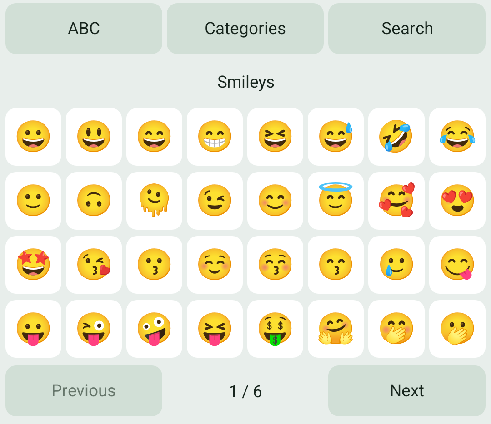
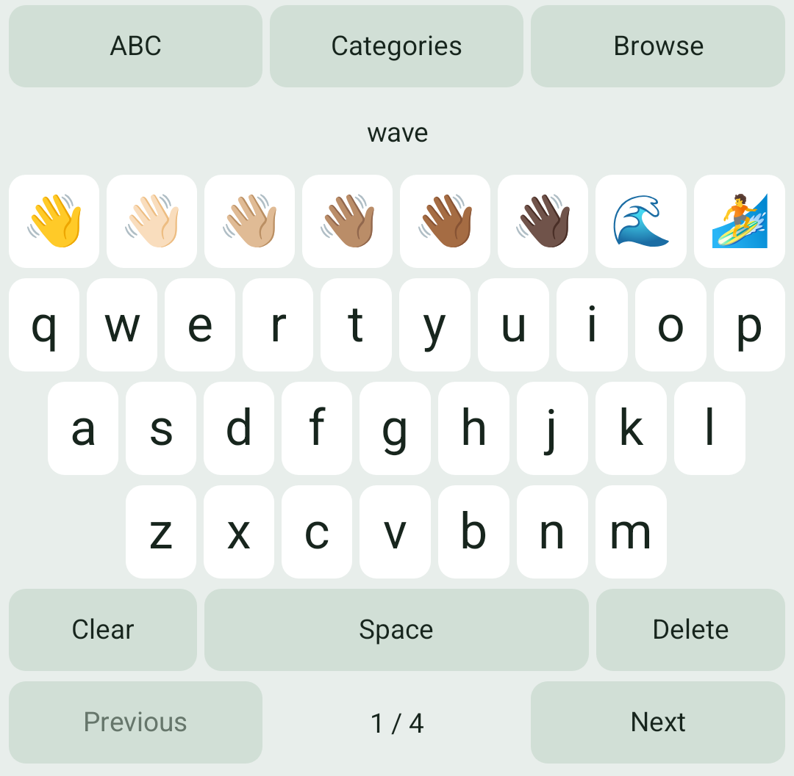
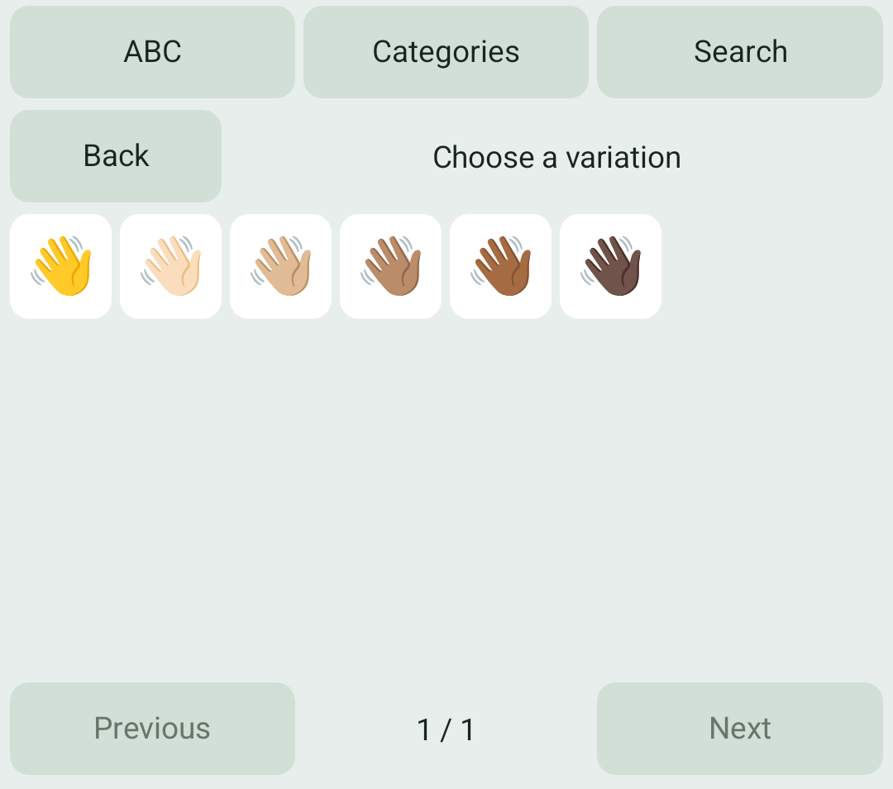

# Emoji on Android

Implemented in unreleased source after alpha12. The published alpha12 APK does
not include this picker. [Mobile status](mobile-roadmap.md) ·
[Resource identity and license](android-emoji-resource.md)

Tap **Emoji** beside Edit on the keyboard. Choose **Categories** to browse,
**Search** to enter an English name or keyword, or **ABC** to return to typing.
The number-row and Terminal toggles are now at the top of **Tools**.

Search uses its own letter keys, **Space**, **Delete** and **Clear**. These keys
edit only the search query; they do not type into the receiving app. The query
is limited to 48 characters. Use **Previous** and **Next** for more matches.
Your QWERTY/QWERTZ/AZERTY layout, sizing, theme and Full/Left/Right alignment apply.

Tap an emoji to insert its exact character sequence at the current selection,
without a space or a Send/Enter action. A browsed emoji with tone variants opens
a variation page; tap the exact variation you want. Search also finds individual
variants by their English descriptions. **Back** returns from variations.

The catalog includes 3,944 fully qualified Emoji 17 sequences and CLDR 48 English
names/keywords. Only emoji supported by the device's font are displayed. An older
font may show fewer choices; the keyboard does not download fonts. The receiving
app can render the inserted sequence differently.

The picker works offline and uses no clipboard, typing history or saved search.
Leaving the picker, changing fields, hiding the keyboard or rebuilding its layout
clears the query. Returning to the picker starts a fresh search. Raw terminal
fields disable Emoji because they require key events rather than Unicode text.

The images are keyboard-only renders from the dedicated API 35 emulator with
synthetic input. Source and automated editor checks are recorded in the
[acceptance plan](plans/active/android-local-emoji.md). Physical-phone comfort,
landscape, TalkBack/Switch Access and broad host-editor acceptance remain open.
