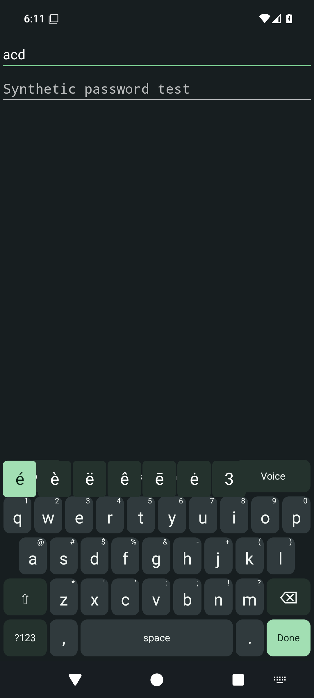

# Android typing surface

## Released in alpha07

Hold a letter, slide to the highlighted accent or symbol, then release to insert.
Slide outside the choices to cancel. **Tools → Accents → letter** retains a tap-only
route. Slide the spacebar horizontally to move the cursor; tapping it still inserts
a space. Model setup now uses **Import a model**, identifying reviewed tiny.en,
base.en or small.en files by size and SHA-256 independently of the download selector.

Revision ee47aa7 passed [CI run 34443696731](https://github.com/RioPlay/utterleaf/actions/runs/34443696731):
8 JVM, 44 API 35 emulator and 3 release-contract tests, with no emulator failures or
skips. Tests include actual injected gestures in a synthetic editor, finger drift,
direction reversal, cancellation, multitouch, stale controls and narrow geometry.
Physical-phone, TalkBack, Switch Access and landscape acceptance remain open.

[Signing run 34444324935](https://github.com/RioPlay/utterleaf/actions/runs/34444324935)
passed signature, installation and upgrade checks and published the
[signed alpha07 APK](https://github.com/RioPlay/utterleaf/releases/tag/android-v0.1.0-alpha07)
with the existing release identity. Physical Obtainium updates and retained model
and preference data still need device validation.

Actual debug emulator capture from ee47aa7, visually reviewed. The strip stays within
the existing secure keyboard window without increasing its height. Instrumentation
temporarily permits synthetic screenshots and restores protection; release keyboard
windows retain screenshot protection.

## Released in alpha06

Letter keys show secondary symbol hints, with a setting to hide them. Hold a letter
for common Latin accents and its symbol, or use **Tools → Accents → letter** without
holding. Choose a character to insert it, or Cancel. Shift/Caps affect accented
letters. At very large font sizes, hints yield to the primary label. These accents
do not add dictionaries, prediction or full multilingual composition.

Picker and panel callbacks are scoped to their layout and input session, so stale
controls cannot insert into a later field. Instrumentation covers selection,
cancellation, rejected input, stale controls, narrow layouts and real editor insertion.
Revision cdf29cd passed [CI run 34440735943](https://github.com/RioPlay/utterleaf/actions/runs/34440735943):
8 JVM, 38 API 35 emulator and 3 release-contract tests. The live editor test includes
successful accent insertion and a retained old picker button rejected after a
password-field switch. Actual hints and picker captures were visually reviewed.
[Signing run 34441330864](https://github.com/RioPlay/utterleaf/actions/runs/34441330864)
passed installation, upgrade and stable-certificate checks before publishing the
[signed alpha06 APK](https://github.com/RioPlay/utterleaf/releases/tag/android-v0.1.0-alpha06).
Physical-phone, TalkBack and Switch Access acceptance remains open.

Current screenshots above and in the mobile guide supersede the alpha06 captures.

## Released foundation

Released in **alpha05**. Revision f74b862 passed
[CI run 34432378047](https://github.com/RioPlay/utterleaf/actions/runs/34432378047):
4 JVM, 32 API 35 emulator and 3 release-contract tests, with zero emulator failures
or skips. Actual setup and synthetic live-IME screenshots were reviewed; see
[current images and release evidence](mobile.md#android--typing-and-local-dictation-preview).
Physical, landscape and assistive-technology acceptance remains open.

The alpha05 layout addresses feedback that the original keyboard felt like a grid
of application buttons. This is an independent implementation. A historical
[public keyboard visual](https://keyboard.futo.tech/assets/decoration-hero.webp)
was reviewed as a design reference; no third-party source, artwork, fonts or
layouts were imported into the app.

- Letter keys keep a consistent width. The home row is inset by half a key;
  Shift and Delete flank the third row.
- A wide spacebar and dedicated comma and period keys support ordinary writing.
  Enter displays the editor's action, such as Done or Send.
- Voice remains visible. Tools reveals Caps Lock, cursor arrows, settings and
  Android's keyboard switcher. Closing Tools restores the compact typing surface.
- Symbols use two pages with a visible page key. Returning to letters does not
  require a gesture or long press.
- Number row is independently optional. Terminal controls add Esc/Tab, one-shot
  Ctrl/Alt, navigation and a function layer with F1–F12, Insert and forward Delete.
  The function layer replaces letters rather than adding more height. Raw terminal
  fields accept ASCII key events only with this preference enabled; voice stays off.
- Neutral keycaps carry the letters; green marks the editor action and selected
  modifiers. Dark is the default, with light and larger-key preferences retained.
  Insets separate the visible keycaps without creating gaps in their touch areas.
- App content roots handle system bars and cutouts; the IME reserves navigation-bar
  space. Verify actual setup and keyboard captures after the inset regression gate,
  including the Fn layer, landscape and both navigation modes.

Native Android buttons retain spoken labels, focus and click actions. Keys fit
their labels to available width; larger mode increases row height and label size.
Ten columns still limit horizontal target size on narrow phones. This is not a
claim of full accessibility acceptance: TalkBack, Switch Access, large system
fonts, landscape, and physical typing comfort need user testing.

The typing surface adds no networking, text history, surrounding-text reads or
clipboard access. Password fields still disable dictation. The release IME window
remains protected against screenshots. CI captures only a synthetic debug test
window, temporarily restoring visibility within instrumentation and restoring its
secure flag immediately afterward.

Suggestions, autocorrect, multilingual layouts, emoji and swipe typing remain
separate [roadmap work](mobile-roadmap.md). A better-looking keyboard does not
make these features implemented.
