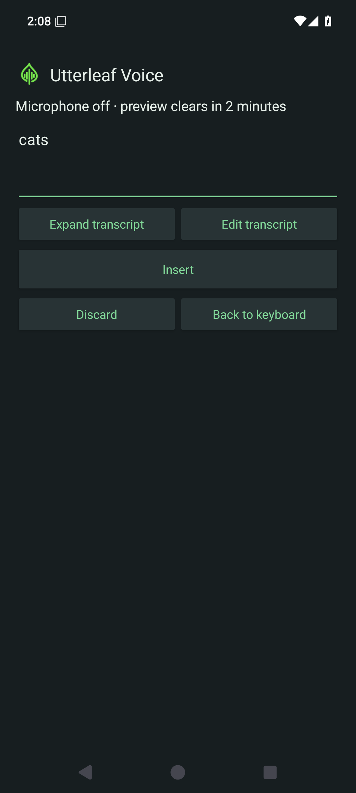
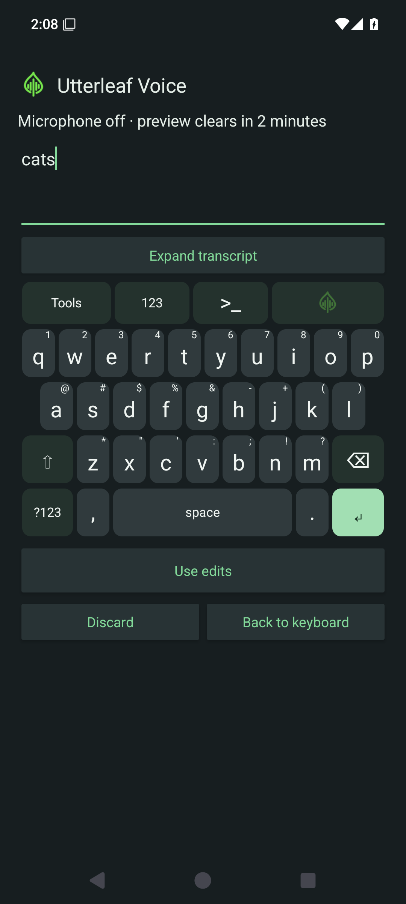
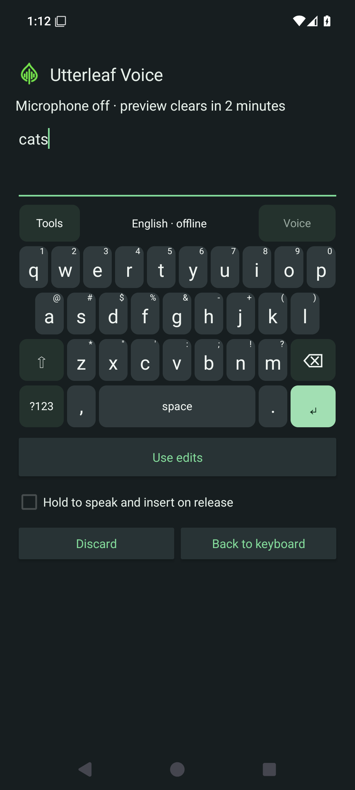
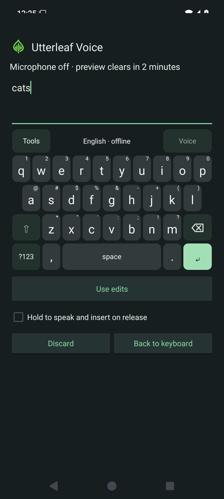

# Android typing surface

## Released in alpha12

**Edit** opens editor actions and navigation in place of the letters; **ABC**
returns to typing. [Quick-action design, release evidence and editor limits](android-quick-actions.md)
record revision `aec275b`, its 74-test emulator pass and signed publication.
The alpha11 and earlier sections below describe those releases unchanged.

## Released in alpha13

[Signed Android alpha13](https://github.com/RioPlay/utterleaf/releases/tag/android-v0.1.0-alpha13)
ships these fixes at revision `45da18a`. The release passed
[CI 34516072857](https://github.com/RioPlay/utterleaf/actions/runs/34516072857),
including 76 emulator tests, 8 JVM tests, lint, builds and 3 release contracts.
[Publication 34517132892](https://github.com/RioPlay/utterleaf/actions/runs/34517132892)
verified signed installation/upgrade, reinstallation and certificate continuity.
The downloaded APK matched SHA-256
`ba3d76557b4d10b76831b237283de71e34ccd70541e444652277afb47d78f223`.
Physical-device, TalkBack and model/preference-retention acceptance remain open.

Height and bottom-space sliders now expose their displayed value in the accessible
description, including after Reset. Added tests cover description updates,
accessibility-driven persistence and reset cancellation/confirmation. Quick toggles
also refresh in-memory options from the same saved snapshot they persist. These
changes passed [Android CI 34513111803](https://github.com/RioPlay/utterleaf/actions/runs/34513111803)
at revision `d942098`: 76 API 35 emulator tests with zero failures/skips, 8 JVM
tests, lint, builds and 3 release contracts. This does not establish TalkBack or
physical-device acceptance.

The first run compiled but exposed test synchronization errors: reset confirmation
reopened before asynchronous dismissal completed, and a live-IME action used a
stale accessibility node after editor restart. Tests now await window/panel
transitions and exercise current native IME buttons. All output, persistence and
stale-action assertions remain. Production gesture behavior was not changed.

## Released in alpha11

The single-row toolbar provides **123** for the number row, **>_** for terminal
controls, and the Utterleaf dictation icon. Quick toggles save locally and stay
synchronized with the Settings practice keyboard. Advanced editing controls
remain behind Tools; error and accent-selection feedback still appears when needed.

Voice review supports **Expand transcript**, scrolling and selection, with
**Edit transcript** beside expansion. Entering editing restores the smaller
preview to leave room for keys. Model choices and recording preferences are
hidden during review. Automatic capture completion now switches to processing
without a Stop tap; stale status updates cannot affect a later take.

These are actual API 35 debug-emulator screenshots with synthetic text. Revision
`55e7173` passed [Android CI](https://github.com/RioPlay/utterleaf/actions/runs/34486083030):
71 emulator tests with zero failures/skips, 8 JVM tests, lint and 3 release-contract
tests. [Signing and installation checks](https://github.com/RioPlay/utterleaf/actions/runs/34487215244)
cover the [alpha11 APK](https://github.com/RioPlay/utterleaf/releases/tag/android-v0.1.0-alpha11).
Physical-phone comfort, small-screen/landscape and assistive-technology acceptance
remain open. GPU/NPU acceleration is not included in this release.

## Released in alpha10

Enable **Terminal controls** to use Ctrl and Alt. Hold either modifier, then
press another key with a second finger. Ctrl+Backspace sends a word-delete key
combination to compatible editors. Releasing the modifier or moving outside a
key cancels the physical chord. Tap-to-arm remains available. Held deletion has
an independent preference, enabled by default and restored by Reset.

Setup retains multiple verified English model imports and lets you select the
active model without importing it again. The idle voice panel has an inline
selector when multiple models are installed. Switches are blocked during a take
or import. Old verified imports remain selectable; deleting the active model
leaves voice unavailable until another model is selected.

Revision `cd009b1` passed [CI run 34480299407](https://github.com/RioPlay/utterleaf/actions/runs/34480299407):
67 API 35 emulator tests, 8 JVM tests, lint and 3 release contracts. Coverage
includes actual EditText word deletion through an owned input connection,
modifier release/cancellation, repeat preference persistence/reset, multi-model
retention, legacy selection/deletion, and blocked/stale model-choice callbacks.
[Signing and installation checks](https://github.com/RioPlay/utterleaf/actions/runs/34481384006)
track the [alpha10 APK](https://github.com/RioPlay/utterleaf/releases/tag/android-v0.1.0-alpha10).

Physical-phone, named terminal/editor and accessibility acceptance remain open.
This does not add drag-to-highlight deletion or universal desktop shortcut behavior.

Actual debug API 35 panel fixture from `cd009b1`, visually reviewed. Synthetic
capture is temporarily allowed by the test fixture; release protection remains on.

## Released in alpha09

The keyboard's **Voice** button starts a reviewable take immediately. Stop and
Insert use one primary control; **Edit transcript** provides an owned local
editor. Optional hold mode inserts after release and recognition, with slide-away
cancellation. Idle, recording and processing use the desktop's transparent marks.

Hold Shift then swipe Space to select; hold Backspace or forward Delete to repeat.
Hold period for punctuation. Key height and bottom padding are independently
adjustable, with private practice and reset in settings.

Revision `ed491bd` passed [build and emulator CI](https://github.com/RioPlay/utterleaf/actions/runs/34475913178):
61 API 35 emulator tests, 8 JVM tests, lint and 3 release contracts, with no
emulator failures or skips. [Signed publication](https://github.com/RioPlay/utterleaf/actions/runs/34476752688)
verified the existing certificate, upgrade from signed alpha03, reinstall and setup
launch. [Download alpha09](https://github.com/RioPlay/utterleaf/releases/tag/android-v0.1.0-alpha09).

Physical-phone reach, TalkBack/Switch Access, landscape, named terminal behavior
and retained model/preferences during a real Obtainium update remain unverified.
Clipboard tools, correction/prediction and silence detection remain roadmap work.

Actual debug API 35 panel fixture with synthetic text, not a full host-app capture.
The fixture temporarily permits capture and restores protection; release windows
retain screenshot protection. Screenshot review does not establish one-handed
reach on physical phones.

## Released in alpha07

Hold a letter, slide to the highlighted accent or symbol, then release to insert.
Slide outside the choices to cancel. **Tools → Accents → letter** retains a tap-only
route. Slide the spacebar horizontally to move the cursor; tapping it still inserts
a space. Model setup now uses **Import a model**, identifying reviewed tiny.en,
base.en or small.en files by size and SHA-256 independently of the download selector.

Revision ee47aa7 passed [CI run 34443696731](https://github.com/RioPlay/utterleaf/actions/runs/34443696731):
8 JVM, 44 API 35 emulator and 3 release-contract tests, with no emulator failures or
skips. Tests include actual injected gestures in a synthetic editor, finger drift,
direction reversal, cancellation, multitouch, stale controls and narrow geometry.
Physical-phone, TalkBack, Switch Access and landscape acceptance remain open.

[Signing run 34444324935](https://github.com/RioPlay/utterleaf/actions/runs/34444324935)
passed signature, installation and upgrade checks and published the
[signed alpha07 APK](https://github.com/RioPlay/utterleaf/releases/tag/android-v0.1.0-alpha07)
with the existing release identity. Physical Obtainium updates and retained model
and preference data still need device validation.

Actual debug emulator capture from ee47aa7, visually reviewed. The strip stays within
the existing secure keyboard window without increasing its height. Instrumentation
temporarily permits synthetic screenshots and restores protection; release keyboard
windows retain screenshot protection.

## Released in alpha06

Letter keys show secondary symbol hints, with a setting to hide them. Hold a letter
for common Latin accents and its symbol, or use **Tools → Accents → letter** without
holding. Choose a character to insert it, or Cancel. Shift/Caps affect accented
letters. At very large font sizes, hints yield to the primary label. These accents
do not add dictionaries, prediction or full multilingual composition.

Picker and panel callbacks are scoped to their layout and input session, so stale
controls cannot insert into a later field. Instrumentation covers selection,
cancellation, rejected input, stale controls, narrow layouts and real editor insertion.
Revision cdf29cd passed [CI run 34440735943](https://github.com/RioPlay/utterleaf/actions/runs/34440735943):
8 JVM, 38 API 35 emulator and 3 release-contract tests. The live editor test includes
successful accent insertion and a retained old picker button rejected after a
password-field switch. Actual hints and picker captures were visually reviewed.
[Signing run 34441330864](https://github.com/RioPlay/utterleaf/actions/runs/34441330864)
passed installation, upgrade and stable-certificate checks before publishing the
[signed alpha06 APK](https://github.com/RioPlay/utterleaf/releases/tag/android-v0.1.0-alpha06).
Physical-phone, TalkBack and Switch Access acceptance remains open.

Current screenshots above and in the mobile guide supersede the alpha06 captures.

## Released foundation

Released in **alpha05**. Revision f74b862 passed
[CI run 34432378047](https://github.com/RioPlay/utterleaf/actions/runs/34432378047):
4 JVM, 32 API 35 emulator and 3 release-contract tests, with zero emulator failures
or skips. Actual setup and synthetic live-IME screenshots were reviewed; see
[current images and release evidence](mobile.md#android--typing-and-local-dictation-preview).
Physical, landscape and assistive-technology acceptance remains open.

The alpha05 layout addresses feedback that the original keyboard felt like a grid
of application buttons. This is an independent implementation. A historical
[public keyboard visual](https://keyboard.futo.tech/assets/decoration-hero.webp)
was reviewed as a design reference; no third-party source, artwork, fonts or
layouts were imported into the app.

- Letter keys keep a consistent width. The home row is inset by half a key;
  Shift and Delete flank the third row.
- A wide spacebar and dedicated comma and period keys support ordinary writing.
  Enter displays the editor's action, such as Done or Send.
- Voice remains visible. Tools reveals Caps Lock, cursor arrows, settings and
  Android's keyboard switcher. Closing Tools restores the compact typing surface.
- Symbols use two pages with a visible page key. Returning to letters does not
  require a gesture or long press.
- Number row is independently optional. Terminal controls add Esc/Tab, one-shot
  Ctrl/Alt, navigation and a function layer with F1–F12, Insert and forward Delete.
  The function layer replaces letters rather than adding more height. Raw terminal
  fields accept ASCII key events only with this preference enabled; voice stays off.
- Neutral keycaps carry the letters; green marks the editor action and selected
  modifiers. Dark is the default, with light and larger-key preferences retained.
  Insets separate the visible keycaps without creating gaps in their touch areas.
- App content roots handle system bars and cutouts; the IME reserves navigation-bar
  space. Verify actual setup and keyboard captures after the inset regression gate,
  including the Fn layer, landscape and both navigation modes.

Native Android buttons retain spoken labels, focus and click actions. Keys fit
their labels to available width; larger mode increases row height and label size.
Ten columns still limit horizontal target size on narrow phones. This is not a
claim of full accessibility acceptance: TalkBack, Switch Access, large system
fonts, landscape, and physical typing comfort need user testing.

The typing surface adds no networking, text history, surrounding-text reads or
clipboard access. Password fields still disable dictation. The release IME window
remains protected against screenshots. CI captures only a synthetic debug test
window, temporarily restoring visibility within instrumentation and restoring its
secure flag immediately afterward.

Suggestions, autocorrect, multilingual layouts, emoji and swipe typing remain
separate [roadmap work](mobile-roadmap.md). A better-looking keyboard does not
make these features implemented.
