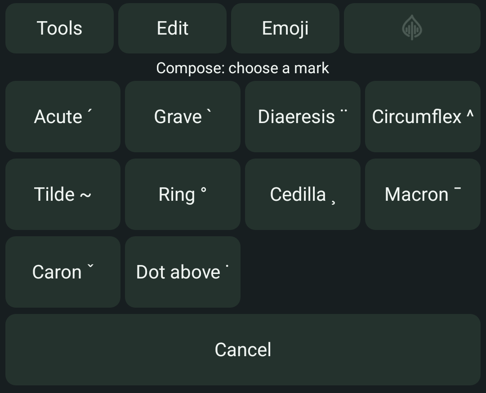

# Compose accented Latin characters

**Implemented in unreleased Android source, after alpha12.**

Open **Tools → Compose**, choose a named accent, then tap a letter. For example,
**Acute → e** inserts **é**. Nothing is inserted while choosing the mark. A valid
pair inserts one character at the current selection and returns to ordinary typing.
It does not press Enter or submit the field.

Owned application view on the API 35 emulator, with no receiving-app text shown.

Use **Shift** for uppercase, or enable **Caps** in Tools before opening Compose.
**Cancel** leaves the receiving field unchanged. Unsupported combinations keep
the mark selected and show **Combination unavailable**; no partial accent is
inserted. If insertion is refused, check the field before trying again or cancelling.

| Mark | Supported base letters | Example |
| --- | --- | --- |
| Acute | a, e, i, o, u, y, c, n, s, z | e → é |
| Grave | a, e, i, o, u | a → à |
| Diaeresis | a, e, i, o, u, y | u → ü |
| Circumflex | a, e, i, o, u | o → ô |
| Tilde | a, o, n | n → ñ |
| Ring | a | a → å |
| Cedilla | c, s | c → ç |
| Macron | a, e, i, o, u | a → ā |
| Caron | c, n, s, z, l | s → š |
| Dot above | e, z | e → ė |

Both lowercase and uppercase forms are supported for these pairs. Compose is
available with the original QWERTY, QWERTZ and AZERTY positions. The existing
**Tools → Accents → letter** and hold-to-pick character routes remain available.
These character choices do not select a dictionary or speech language.

Compose also works inside the [private draft editor](android-private-draft.md),
where the character stays in the local draft until **Insert**. It is unavailable
in terminal/raw mode, which keeps literal key behavior. Changing fields, hiding
the keyboard or switching modes clears the pending mark. Compose does not read
surrounding text or the clipboard, save text, or learn from typing.

See the [implementation and acceptance record](plans/active/android-latin-compose.md).
Current tests and owned views use an API 35 emulator. Physical-phone comfort,
landscape, assistive-technology and broad-editor acceptance remain open.
