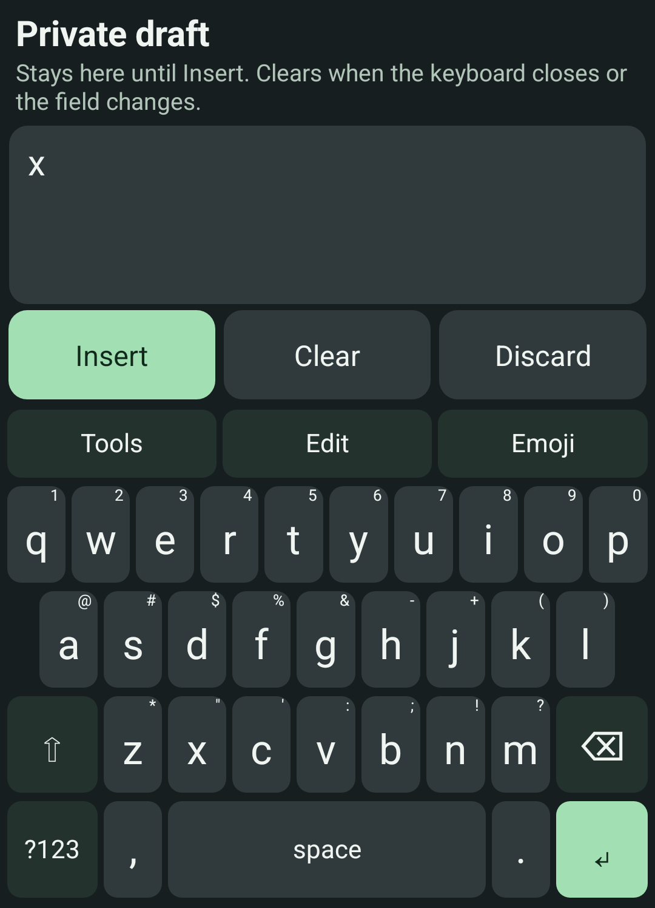

# Private draft on Android

Implemented in unreleased source after alpha12. The published alpha12 APK does
not include this editor. [Mobile status](mobile-roadmap.md) ·
[Acceptance record](plans/active/android-private-draft.md)

Open **Tools → Private draft** in an ordinary text field. The draft starts empty.
Use Utterleaf's on-screen keys to write and revise, **Edit** for selection and undo/redo, and
**Emoji** for local emoji search. Enter adds a newline inside the draft.
Physical-keyboard typing and clipboard shortcuts are disabled in this mode.

Choose **Insert** when ready. Utterleaf inserts the exact draft at the receiving
app's current selection and returns to typing. It adds no extra space or newline
and does not press Send. **Clear** empties the draft and its undo history while
keeping the editor open. **Discard** empties it and returns to ordinary typing.

Intermediate edits stay in Utterleaf's memory. They are not sent to the receiving
app, copied to the system clipboard, saved as history or used for typing learning.
The draft clears when the keyboard closes, the field changes or the keyboard
session ends. Reopening starts empty. Private draft is unavailable in password
and raw terminal fields. Clipboard import/export, dictation and cross-field draft
retention are not part of this mode.

If insertion is unavailable, the draft remains for another attempt. If the app
does not confirm insertion, inspect the destination first: it may already contain
the text. **Enable another insert** only re-enables the button; it does not insert
again by itself. There is no automatic retry or clipboard fallback.

Drafts hold up to 16,000 UTF-16 units and 20 undo/redo snapshots in total. An edit
that exceeds the limit is refused without inserting a partial string. Navigation
and deletion preserve surrogate pairs; complete grapheme-cluster behavior for
every script is not established. The receiving app sees the final text and may
retain it. This mode does not hide visible text from the operating system or
authorized accessibility services, or promise forensic memory erasure.

Your theme, key sizing, letter layout and Full/Left/Right alignment apply. The
image is a keyboard-only render from the dedicated API 35 emulator with synthetic
text. Physical-phone comfort, landscape, TalkBack/Switch Access and broad editor
acceptance remain open.
