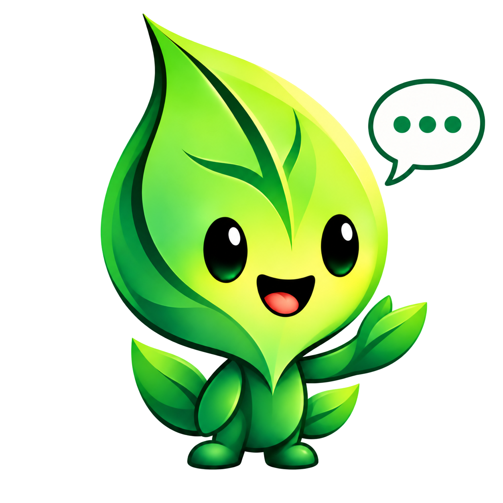
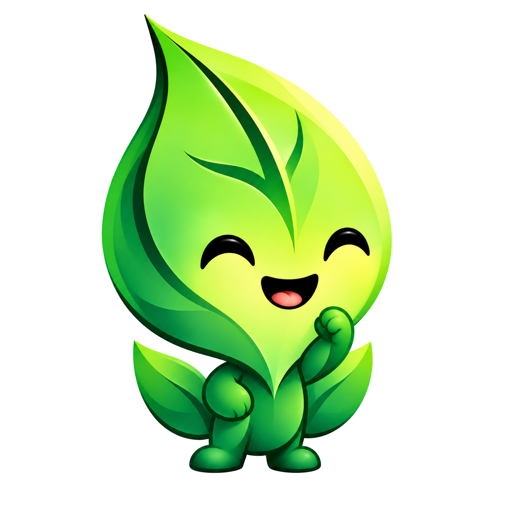
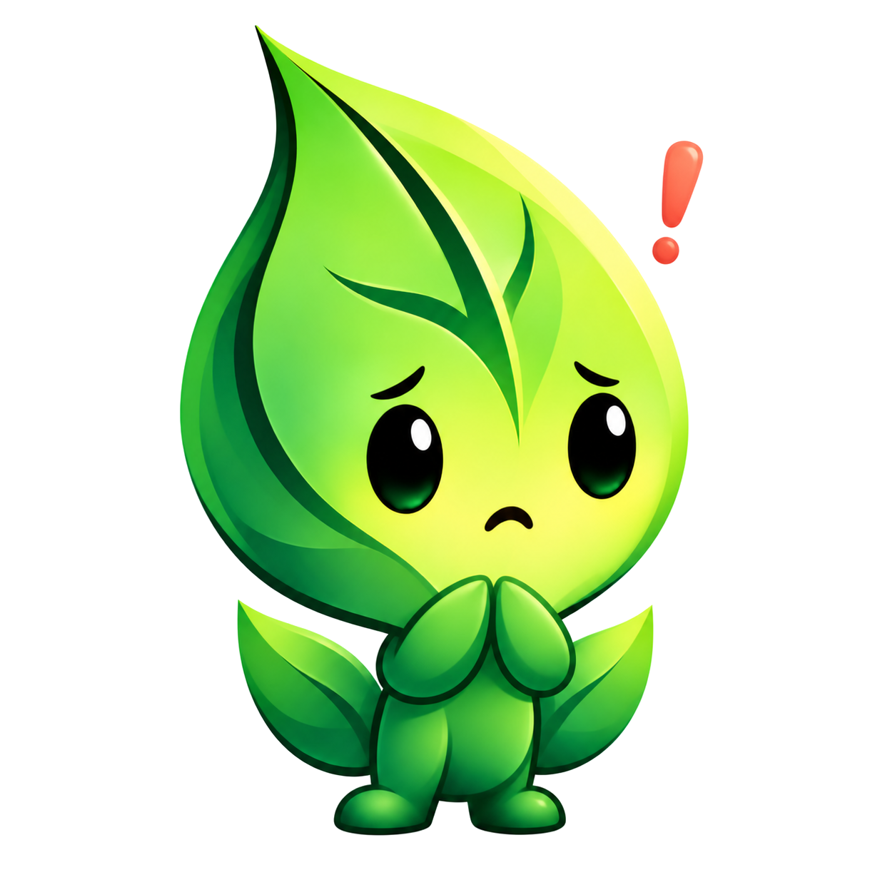

# Utterleaf identity

<picture>
  <source media="(prefers-color-scheme: dark)" srcset="assets/brand/wordmark-inverse.png" />
  
</picture>

Utterleaf's mark is an upright leaf enclosing
five waveform bars, with the center bar continuing into the stem. Green is the
primary accent; neutral surfaces keep the utility quiet and readable.

The app sidebar uses the inverse wordmark on charcoal. GitHub selects primary
or inverse artwork to suit the reader's color scheme. See the [interface guide](interface.md)
for layout, copy, and screenshot conventions.

## Implemented in the application

The tray and Settings window use the shared leaf/waveform renderer. Settings use
leaf-green accents and “Let ideas speak.” Windows executable icons are regenerated
from the same geometry. Existing builds must be rebuilt to acquire the new icon.

| Ready | Recording | Processing | Error |
| --- | --- | --- | --- |
|  |  |  |  |
| Green leaf | Coral leaf and solid dot | Cyan leaf and three dots | Coral leaf and exclamation |

Tooltips and the existing status pill continue to explain the actual state.
Recording and listening describe the same capture operation. Model loading and
transcription share the processing icon, with their distinct text labels.
Microphone, engine, transcription, and delivery failures use the error icon.

Offline operation is normal readiness, not a gray disconnected/error state.
Utterleaf has no speech-output feature, so the board's “speaking” tray state is
not exposed. Paused and muted states are also not invented for this artwork.

## Exported assets

- PNG app icons: dark, light, and green surfaces at 16, 24, 32, 48, 64, 128, 256,
  and 512 pixels. The dark badge protects contrast on light and dark panels.
- Transparent leaf-only marks in PNG and SVG: green, black, gray, light, and inverse.
- Transparent state cutouts at every PNG size, with separate colors for light and dark backgrounds.
- Primary and inverse wordmarks in transparent PNG and SVG, with editable live text in SVG.
- Windows multi-resolution ICO: `packaging/utterleaf.ico`.
- macOS ICNS: `docs/assets/brand/utterleaf.icns`. Supplied for future app-bundle
  packaging; the current portable macOS distribution is not an `.app` bundle.

Export the shared catalog with `python scripts/export_brand.py`.
The PNG wordmarks and mascot cutouts are maintained artwork; this command preserves them. Windows packaging
also regenerates its ICO using `packaging/make_icon.py`. Runtime rendering uses
Pillow, which is already a dependency; no SVG renderer or network call is needed.

## Utterling

Utterling follows the supplied reference's tall curled leaf head, layered emerald
folds, lime highlights, glossy eyes, and small leafy body. Seven illustrated PNG
expressions replace the initial simplified vector drafts. The approved app icons
and wordmark are unchanged.

All mascot PNGs are now RGBA cutouts with real alpha transparency and antialiased edges.
GIMP removed the exterior white matte while preserving eye highlights and the
intentional white speech-balloon interior. No checkerboard is baked into the files.
Utterling appears in the Dictation (Default), Vocabulary (Typing), Voice commands
(Speaking), and Help (Thinking) settings headers. All seven expressions have a
role in normal Settings use, without opening the artwork guide. During the
microphone check it shows thinking while opening the device, listening after it
opens, success when audio is detected, and concern if opening fails. A stopped
check returns to the default expression; low input keeps the thoughtful expression.
Recording overlays and tray icons remain compact.

All seven expressions and both wordmark PNGs are bundled in `utterleaf/assets` and loaded locally using package
resources, including in wheels and PyInstaller distributions. The artwork is
decorative: status text, focus order, and microphone controls remain authoritative. Generation used the
built-in image tool; the prompt set is in
[mascot-prompts.json](assets/brand/mascot-prompts.json). The icon export script leaves
these artwork files intact.

| Default | Listening | Thinking | Speaking |
| --- | --- | --- | --- |
|  |  |  |  |

| Success | Typing | Concern |
| --- | --- | --- |
|  |  |  |

Keep meaningful instructions in text. Mascots are decorative and must never be
the sole indication of recording, an error, or successful delivery.

## In-app reference and export

Open **Help → Icons & artwork…**. Five tabs show the entire catalog
on light and dark backgrounds, with filenames and usage notes:

| Tab | Contents | File references |
| --- | --- | --- |
| Tray states | Ready, Recording, Processing, Needs attention; badge and cutout versions | `tray-{idle,recording,busy,error}.png`; `cutout-STATE-for-{light,dark}-SIZE.png` |
| App badges | Dark, light, green rounded-square designs | `app-{dark,light,green}-SIZE.png` |
| Cutout marks | Green, black, gray, light, inverse | `mark-VARIANT-SIZE.png`, `mark-VARIANT.svg` |
| Utterling | Welcome, Listening, Thinking, Success, Concern, Speaking, Typing | `utterling-{default,listening,thinking,success,error,speaking,typing}.png` |
| Wordmark | Primary for light surfaces, inverse for dark surfaces | `wordmark.png`, `wordmark-inverse.png`, and matching SVGs |

**Export asset pack?** saves a ZIP containing 151 files, including `usage.json`,
Windows ICO, macOS ICNS, and PNG sizes 16, 24, 32, 48, 64, 128, 256, 512 for app
badges, cutout states, and marks. Mascots retain their 1254 ? 1254 resolution.
The packaged wordmark PNGs are 390 ? 105. The export runs in the background and
replaces an existing archive only after the entire new archive is complete.

### Choosing the right transparency

- **App badges:** opaque rounded-square fill is intentional; the outside corners
  are transparent. They preserve the approved app-icon appearance on either panel.
- **Cutouts:** only the leaf/waveform and any state symbol remain. The interior,
  exterior, and gap around a state symbol are transparent. Use `for-light` on light
  surfaces and `for-dark` on dark surfaces; one color cannot contrast with every background.
- **Monochrome marks:** black/green/gray suit light surfaces; light/inverse suit
  dark surfaces. These are available as actual RGBA PNGs, not just SVG.
- **Mascots:** alpha is preserved during package loading and resizing, so no white
  rectangle reappears at runtime. Speaking's white balloon is part of the illustration.
- **Wordmarks:** the inverse version keeps the text and leaf visible on dark surfaces.

All artwork and exports work locally, without a model download or network access.
The two editorial poses are displayed and documented in the app guide, without
inventing speaking/typing runtime states.

### Cutout preparation and verification

The GIMP batch script is `scripts/cutout_mascots_gimp.py`; it expects the original
white-background PNGs in `artifacts/mascot-sources` and `UTTERLEAF_BRAND_ROOT` to name
the repository. Originals were preserved there during this pass. Its exterior
selection protects interior highlights; a narrow edge selection removes white
matting with [GIMP's drawable filter API](https://developer.gimp.org/resource/writing-a-plug-in/tutorial-gegl-ops/).
GIMP is an authoring tool only, not an app dependency.

Tests check RGBA channels, fully transparent pixels, opaque artwork, intermediate
edge alpha, preserved highlights, complete ZIP contents, atomic export failure,
and all guide entries. Visual reviews cover both white and dark backgrounds.
