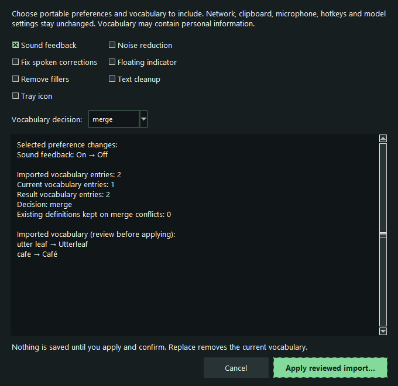

# Back up preferences and vocabulary

Available from desktop v0.4.0; older v0.3.8 downloads do not include this feature.

Settings → Help → Local backup provides export and import review dialogs. Save
or discard any pending Settings edits first. Export lets you select preferences and
optional vocabulary, review the plaintext content, then choose a new destination.
Existing files are refused. Import starts with a selected JSON file and no changes
selected. Choose preferences and keep/merge/replace vocabulary, inspect the preview,
then choose Apply reviewed import and confirm. Cancel leaves live files untouched.
There is no backup CLI yet.



Actual application dialog using synthetic preferences and vocabulary.

The validation core reads and writes no files, starts no capture, and makes no
network calls. The separate persistence helper only reads selected backup files
and the normal settings/vocabulary locations; imported JSON cannot supply paths.

Version 1 exports only `text_cleanup`, `remove_fillers`, `fix_corrections`, `beep`,
`tray`, `indicator`, and `denoise`. Export can select a subset. Network permission,
clipboard restoration, live preview, hotkeys, microphone, model/device settings,
paths, control tokens, logs, audio, and transcripts are excluded. Imported unknown
keys are rejected, rather than silently retained for future use.

The 0.4.6 RC1 Windows preview also offers **Output style** (`output_format`)
as an explicitly selectable portable preference, validated as `prose` or `markdown`.
Backups without it preserve the destination's existing choice. Older applications
reject this new key under their strict schema; omit Output style when preparing a
backup for an older build. Models, credentials, network and clipboard permissions
remain outside this portable preference set.

Vocabulary export is optional and contains explicit `spoken`/`written` pairs;
comments are omitted. Vocabulary can contain personal information the user entered,
so the caller must show the selected content before saving or sharing the JSON.
This format is plaintext, with no implied encryption or secret detection.

The input is UTF-8 JSON, limited to 512 KiB, with an exact top-level schema and
integer version 1. Duplicate JSON keys, non-finite numbers, unsupported versions,
unknown preferences, invalid types, duplicate case-insensitive spoken terms and
control/format characters are rejected. Vocabulary is limited to 2,000 entries,
256 characters per term and 256 KiB of rendered dictionary text. Existing malformed
or oversized vocabulary causes merge to fail, without dropping existing entries.

The same preview includes the separately selectable speech-end enable,
pause and automatic-insert preferences. These are local behavior choices; backup
does not contain audio, detector weights or reviewed transcript text. Imported
preferences still require a deliberately started take and the normal resource
and target checks. Older applications do not recognize these new keys.

## Integration API

```python
export_backup(cfg, vocabulary_text, *, preference_keys=None,
              include_vocabulary=True) -> str
inspect_backup(payload: str | bytes) -> BackupPlan
merge_backup(plan, cfg, current_vocabulary, *, preference_keys=(),
             vocabulary_mode="keep") -> BackupValues
```

`BackupPlan` is immutable review data: `preferences` is a tuple of key/value pairs,
and `vocabulary` is a tuple of spoken/written pairs or `None` when excluded.
`BackupValues` contains a new `config`, candidate `vocabulary_text`, and
`vocabulary_conflicts`. No API mutates the supplied Config. No argument is treated
as a filesystem path. Invalid inputs raise `BackupError` without echoing content.

Import selects no preferences and keeps vocabulary by default. Explicit `merge`
preserves original vocabulary text/comments and existing definitions, appends new
entries, and reports conflicting spoken terms. Explicit `replace` uses the imported
vocabulary; an exported empty list can clear it, but excluded vocabulary cannot.
Network, clipboard and other excluded settings always retain their current values.

`backup_store.read_backup(path)` performs bounded reading and validation.
`write_backup(path, payload)` creates a new file exclusively with restrictive creation
permissions; it never replaces an existing destination. `prepare_import(plan,
preference_keys=(), vocabulary_mode="keep")` returns an `ImportReview` with candidate
values and before/after preference changes. `apply_import(review)` rejects stale
settings or changed destinations, rebuilds the candidates, and writes only selected
changes. Settings refreshes its form and requests app reload only after success.

Each changed live file uses a byte-preserving temporary write and atomic replacement.
If a later write fails, completed writes are rolled back to their exact original
bytes, including Windows line endings; newly created files are removed on rollback.
If an external writer has subsequently changed a file, rollback refuses to overwrite
that edit and reports incomplete recovery. Network/clipboard/live-preview settings
with malformed existing types are rejected instead of rewritten.

This provides rollback on ordinary write failures, **not crash-atomic two-file
persistence**. Power loss or process termination between replacements can leave a
partial import. External editors do not share a transaction lock: source snapshots
are checked before replacement, but concurrent writes cannot be fully serialized.
Do not edit the live files externally while applying an import. Disk-wide failures
can also prevent rollback; the dialog reports that recovery is incomplete rather
than claiming success. A transactional shared store and crash-recovery design remain
future work if stronger guarantees are needed.

Focused validation: `python -m pytest tests/test_backup.py tests/test_backup_store.py
tests/test_backup_ui.py tests/test_settings_ui.py tests/test_settings.py` uses synthetic
files and real Tk widgets. Coverage includes schema/size rejection, Unicode, explicit
choices, privacy preservation, merge conflicts, cancellation, stale reviews, partial
save rollback, rollback conflicts, overwrite refusal, and compact-window keyboard
navigation. Screen-reader testing and additional OS accessibility checks remain native
acceptance work.
