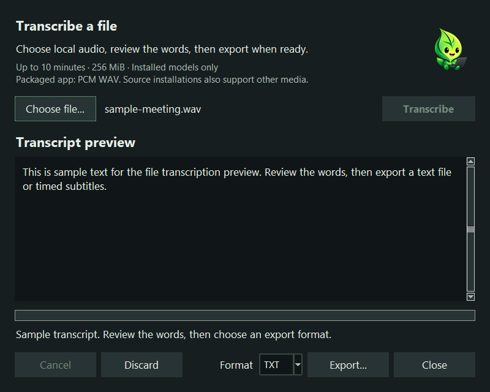

# Local file transcription

Available from desktop v0.4.0. This first version processes one explicitly selected
local file. It does not record system audio or create transcript history.

Open **Tools → Transcribe a file** from the tray, or run `utterleaf --files`.
Choose a file, select **Transcribe**, and review the preview. Choose TXT, SRT, or
VTT before **Export**. Existing destinations require a replace confirmation;
the original media file cannot be used as the export destination. **Discard**
clears the preview and **Close** cancels any work and discards the preview.
Opening the tool again brings its existing window forward. Settings keeps its
own separate window. No microphone opens merely because this tool is open.



Actual application window with synthetic sample text; no personal recording is shown.

PCM WAV works immediately: mono or stereo, 8/16/24/32-bit integer samples, and
8–48 kHz sample rates. **More formats…** connects a separately installed FFmpeg
decoder for **MP3, M4A/M4B, AAC, FLAC, OGG, Opus, MP4, MOV, WebM, MKV**, and other
WAV variants. Support depends on the codecs in the installation you select.
This adds no codecs to Utterleaf's download. Follow the one-time setup below;
you do not need Python or a source installation for these formats.

## Enable common audio and video files

1. Open **Tools → Transcribe a file → More formats…**.
2. Install FFmpeg using the instructions for your computer below.
3. Choose **Choose FFmpeg…**, select its executable, and confirm that you want
   Utterleaf to use that program. Nothing is executed during this selection.
4. Choose **Done**, select your MP3, M4A, video, or other supported file, and
   choose **Transcribe**. The first audio track is used; video is not decoded.

On **Windows**, choose **Download page…**. On the official FFmpeg page, follow
**Windows builds from gyan.dev**, then download **release essentials ZIP**.
Use **Extract All**, keep the extracted folder in a permanent location such as
`C:\Tools\FFmpeg`, and choose the extracted `bin\ffmpeg.exe`. Select the executable,
not the ZIP, an installer, or `ffprobe.exe`. The essentials build is sufficient;
the full build is unnecessary for the common formats above. FFmpeg's own download
page links to this independent build provider. [FFmpeg downloads](https://ffmpeg.org/download.html),
[Gyan build descriptions](https://www.gyan.dev/ffmpeg/builds/).

The provider publishes a `.sha256` next to the ZIP. In PowerShell, run
`Get-FileHash "$HOME\Downloads\ffmpeg-release-essentials.zip" -Algorithm SHA256`
and compare the result with that checksum before selecting the executable.
Use the current provider page rather than an executable from a message or random
mirror. The checksum checks the downloaded archive against its publisher's value;
it is not a separate audit of the program.

On **macOS**, if you already use Homebrew, run `brew install ffmpeg`. On
**Ubuntu/Debian**, run `sudo apt install ffmpeg` through your normal package manager.
For other Linux distributions, use their supported FFmpeg package. Then run
`command -v ffmpeg` and choose that executable in Utterleaf (often `/usr/bin/ffmpeg`
on Linux). In the macOS picker, **Command+Shift+G** lets you enter its folder path.
Utterleaf does not run these installation commands for you.
[Homebrew package](https://formulae.brew.sh/formula/ffmpeg),
[Ubuntu package](https://packages.ubuntu.com/noble/ffmpeg).

**Download page…** only opens your browser. Utterleaf never downloads, installs,
or automatically runs a decoder found on PATH. The chosen executable's location
and SHA-256 are saved in `file-decoder.json` in the app settings folder; these
machine-specific details are excluded from preference backups. If FFmpeg moves
or its executable changes during an update, select it again. **Forget selection**
removes that setting without deleting your FFmpeg installation. Ordinary PCM WAV
continues working even when the optional decoder is missing or changed.

## Processing and limits

The built-in PCM reader uses Python's standard library and the existing NumPy
resampler in bounded one-second blocks. Source installations with PyAV can also
read additional media without setup. An explicitly selected FFmpeg installation
is used for non-WAV media in both source and packaged builds; WAV uses the built-in
reader or PyAV when possible and the optional decoder when the packaged reader
cannot support that WAV variant.

Decoding downmixes audio to mono at 16 kHz. Playlists, URLs, capture devices, and
reference movies are outside the optional decoder's supported input set. No audio is uploaded, downloaded, or written
to temporary storage. File mode never downloads models, even if ordinary dictation
allows downloads: install the selected model explicitly first.

The initial limits are **256 MiB input and 10 minutes of decoded audio**. Longer
audio is rejected rather than silently truncated. Decoding checks the sample budget
incrementally, independent of possibly incorrect media duration metadata. PCM is
bounded, but native decoder/model memory and execution time are not hard sandbox
limits. Model inference still holds the bounded clip in memory. Full-hour streaming
and cancellation during a native inference call are not implemented.

The optional FFmpeg process has a 120-second decoding deadline and is terminated
on cancellation, failure, or excess decoded output. Output buffering is bounded;
stderr is discarded and automatic FFmpeg reports are disabled. Its allowed input
formats are fixed, input protocols are restricted to local files, and MOV external
track loading is disabled. FFmpeg's 64 MiB allocation setting limits individual
allocations, **not total process memory**. This is not an OS sandbox: the executable
you select is trusted local code running with your user's permissions. Utterleaf
checks its saved executable hash before each use, but cannot secure a malicious
binary, all of its libraries, or a concurrently modified installation. Keep it
current and obtain it from a trusted source.
[FFmpeg input format options](https://ffmpeg.org/ffmpeg-formats.html),
[protocol restrictions](https://ffmpeg.org/ffmpeg-protocols.html),
[allocation option](https://ffmpeg.org/ffmpeg.html).

Use the CPU or CUDA CTranslate2 engine for timestamped files. The OpenVINO adapter
does not expose validated timestamps and returns an actionable error; it never
fabricates subtitle timing. CUDA runtime failures retry on CPU using installed
weights. Dictation's existing string recognition API is unchanged.

Model segment start/end values are retained in seconds, relative to decoded audio.
They are estimated speech boundaries, not independently verified alignment or
original container timecodes. Container timestamp gaps/offsets are not preserved.
There are no speaker labels. Spoken phrases such as “scratch that” remain literal
transcript text; dictation editing, filler removal, dictionary prompting, and
denoising are not applied to file transcripts.

Exports are explicit UTF-8 TXT, SRT, or VTT. Subtitle times round to milliseconds
with correct carry into minutes/hours. A cue that rounds to zero duration causes
an error rather than an invented duration. Subtitle text uses a single line per
cue and escapes markup characters. Plain text preserves recognized words and
internal whitespace. Existing output files require explicit overwrite. Export
publishes a completed temporary text file atomically; default no-overwrite uses a
hard link, so a filesystem without hard-link support returns an error safely.
There is no automatic save on completion, error, or cancellation.

## Integration API

```python
from utterleaf.file_transcription import transcribe_file
from utterleaf.transcript import export_transcript, TranscriptionCancelled

result = transcribe_file(selected_path, cfg, cancel=stop_event, progress=on_progress)
export_transcript(result, selected_output, format="vtt", overwrite=False)
```

`cancel` is an optional `threading.Event`. `progress(phase, fraction)` receives
`decoding`, `loading`, `recognizing`, or `complete`; unknown fractions are `None`.
Cancellation is checked between decoded frames and generated segments and while
waiting for the recognition lock. Model loading and active native calls must
return before cancellation can finish. Cancellation raises
`TranscriptionCancelled(RuntimeError)` and discards the in-flight result.
Input/format/timing errors raise `ValueError`; media and capability failures raise
`RuntimeError`; ordinary filesystem/model errors retain their original classes.

`Transcript.segments` is an immutable tuple of `Segment(start, end, text)`;
`Transcript.text` joins segment text for plain-text callers. `language` records
the engine language when available. `CTranslateEngine.transcribe_segments` also
accepts a mono 16 kHz float array and the same cancel/progress arguments.
`export_transcript` infers format from the output extension when omitted and
returns the destination `Path`. It does not create missing parent directories.

## Verification and remaining gates

The Windows executable passed local tiny.en CPU recognition of a public speech
fixture and TXT/SRT/VTT exports. Its file window and existing-window activation
also passed. Windows, macOS, and Linux builds/tests passed in
[candidate CI](https://github.com/RioPlay/utterleaf/actions/runs/34426942978).
This is functional evidence, not a broad speech-quality or performance benchmark.

Unit tests cover the actual frozen-build PyAV stub with WAV decoding, PCM widths,
truncation, bounded cancellation, timestamp validation/carry, Unicode, silence, literal editing
phrases, refusal to overwrite, temporary-text cleanup, real PyAV WAV resampling,
malformed/oversized/over-duration inputs, cancellation, offline model loading,
and unsupported-engine errors. These do not establish speech accuracy.

Packaged builds retain the project's policy excluding bundled PyAV/FFmpeg. PCM WAV
support and the separately selected FFmpeg process do not add these libraries to
the archive. Before bundling a decoder, review
bundled codecs and licenses, distribution size, clean installation,
video/audio format coverage, truncated input behavior, and real-speech timing on
supported platforms. Retain the existing packaging exclusion until those gates
are complete. No new decoder dependency is silently installed by this feature.

Common-format validation used synthetic tones encoded and decoded through Gyan
FFmpeg 9.0.1 on Windows: MP3, M4A, AAC, FLAC, OGG, Opus, MP4, MOV, WebM, and MKV.
The test-tool ZIP was verified against the publisher's SHA-256 before execution:
`fec81ae03971d9dd4be3ebe02e263bd2ec1d789483f931bdba5f5715e65da2e9`.
This is evidence for that tested build, not a hash to use for future downloads or
a speech-quality benchmark. Tests also exercise cancellation/timeout child cleanup,
bounded output, changed-executable refusal, source/packaged routing, and setup
confirmation. New compiled-app and native macOS/Linux codec checks remain release
validation work. The test decoder is not redistributed in Utterleaf artifacts.
