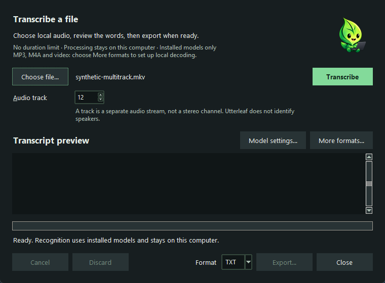
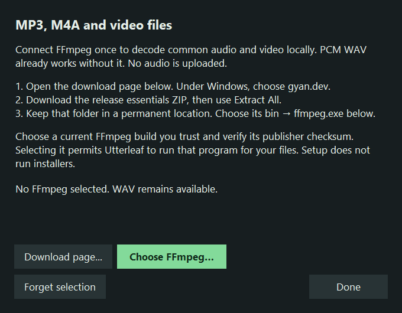

# Local file transcription

Available from desktop v0.4.0. This first version processes one explicitly selected
local file. It does not record system audio or create transcript history.

**0.4.6 RC2 Windows preview:** imported recordings have no total-duration or file-size
cutoff. Audio is decoded and recognized in bounded batches. The file window and
`--audio-track` CLI option can select an individual audio track for each job.
Live OBS capture remains separate, unimplemented work.

**Upcoming source update (unreleased):** the file window inspects actual audio
streams before recognition and replaces the numeric track selector with a list
of track names, sample rates and channel counts. Other formats require a
separately selected FFprobe for inspection. The workflow and setup below describe
that source update; published RC2 retains its numeric selector and FFmpeg-only
setup. Container timing alignment is not implemented in either workflow yet.

Open **Tools → Transcribe a file** from the tray, or run `utterleaf --files`.
Choose a file, wait for **Inspect tracks** to finish, select an actual audio
stream, then choose **Transcribe** and review the preview. Choose TXT, SRT, or
VTT before **Export**. Existing destinations require a replace confirmation;
the original media file cannot be used as the export destination. **Discard**
clears the preview and **Close** cancels any work and discards the preview.
Opening the tool again brings its existing window forward. Settings keeps its
own separate window. No microphone opens merely because this tool is open.



Earlier preview window with a synthetic filename. The upcoming source uses an
inspected track list; no personal recording is shown.

PCM WAV works immediately: mono or stereo, 8/16/24/32-bit integer samples, and
8–48 kHz sample rates. **More formats…** connects a separately installed FFmpeg
decoder for **MP3, M4A/M4B, AAC, FLAC, OGG, Opus, MP4, MOV, WebM, MKV**, and other
WAV variants. Support depends on the codecs in the installation you select.
This adds no codecs to Utterleaf's download. Follow the one-time setup below;
you do not need Python or a source installation for these formats.

## Enable common audio and video files



Earlier Windows setup window, captured with an empty synthetic configuration.
The upcoming dialog adds a separate FFprobe row.

1. Open **Tools → Transcribe a file → More formats…**.
2. Install FFmpeg using the instructions for your computer below.
3. In the **FFmpeg** row choose **Choose…**, select its executable, and confirm that you want
   Utterleaf to use that program. Nothing is executed during this selection.
4. In the **FFprobe** row choose **Choose…** and explicitly select the FFprobe
   executable from your installation. Confirm its use for track inspection.
5. Choose **Done**, select your MP3, M4A, video, or other supported file, wait
   for **Inspect tracks**, choose a reported audio stream, and choose
   **Transcribe**. Video is inspected for its audio streams but is not decoded.

On **Windows**, choose **Download page…**. On the official FFmpeg page, follow
**Windows builds from gyan.dev**, then download **release essentials ZIP**.
Use **Extract All**, keep the extracted folder in a permanent location such as
`C:\Tools\FFmpeg`. Select `bin\ffmpeg.exe` in the FFmpeg row and
`bin\ffprobe.exe` in the FFprobe row. Select the executables, not the archive or
an installer. The essentials build is sufficient;
the full build is unnecessary for the common formats above. FFmpeg's own download
page links to this independent build provider. [FFmpeg downloads](https://ffmpeg.org/download.html),
[Gyan build descriptions](https://www.gyan.dev/ffmpeg/builds/).

The provider publishes a `.sha256` next to the ZIP. In PowerShell, run
`Get-FileHash "$HOME\Downloads\ffmpeg-release-essentials.zip" -Algorithm SHA256`
and compare the result with that checksum before selecting the executable.
Use the current provider page rather than an executable from a message or random
mirror. The checksum checks the downloaded archive against its publisher's value;
it is not a separate audit of the program.

On **macOS**, if you already use Homebrew, run `brew install ffmpeg`. On
**Ubuntu/Debian**, run `sudo apt install ffmpeg` through your normal package manager.
For other Linux distributions, use their supported FFmpeg package. Then run
`command -v ffmpeg ffprobe` and choose each executable in its corresponding row
(often under `/usr/bin` on Linux). In the macOS picker, **Command+Shift+G** lets you enter its folder path.
Utterleaf does not run these installation commands for you.
[Homebrew package](https://formulae.brew.sh/formula/ffmpeg),
[Ubuntu package](https://packages.ubuntu.com/noble/ffmpeg).

**Download page…** only opens your browser. Utterleaf never downloads, installs,
or automatically runs a decoder found on PATH. The chosen executable's location
and SHA-256 are saved separately in `file-decoder.json` and `file-probe.json` in the app settings folder; these
machine-specific details are excluded from preference backups. If FFmpeg moves
or either executable changes during an update, select it again. **Forget** in
each row removes that selection without deleting your installation. Ordinary PCM WAV
continues working even when the optional decoder is missing or changed.

Selecting FFmpeg does not discover or authorize a sibling FFprobe. PCM WAV
inspection does not require either executable.

## Processing and limits

The built-in PCM reader uses Python's standard library and the existing NumPy
resampler in bounded one-second blocks. Source installations with PyAV can also
decode additional media without a selected FFmpeg. An explicitly selected FFmpeg installation
is used in both source and packaged builds for decoding. Other media also
requires an explicitly selected FFprobe for bounded stream and timing
inspection. Ordinary PCM WAV inspection and decoding use the built-in reader
without either tool; other WAV variants use the selected decoder or source PyAV.
Files such as raw AAC can lack a common start time and still be transcribed.
Their missing timing is not converted into a claim of cross-track alignment.
FFprobe inspection has a 30-second deadline, bounded output and cancellation.
The file window checks for ordinary source changes before and after recognition
and discards a changed result. This is not file-content authentication.

Decoding downmixes audio to mono at 16 kHz. Playlists, URLs, capture devices, and
reference movies are outside the optional decoder's supported input set. No audio is uploaded, downloaded, or written
to temporary storage. File mode never downloads models, even if ordinary dictation
allows downloads: install the selected model explicitly first.

The stable v0.4.5 workflow's **256 MiB input and 10-minute** limits are removed from
the 0.4.6 RC2 preview. Recognition consumes at most 30 seconds of
mono 16 kHz audio per batch, preferring a quiet pause in the final five seconds.
If no qualifying pause is found, the batch ends at 30 seconds. Every sample is
retained once, in order; batching does not remove repeated transcript words.
Decoding pauses while recognition uses a batch; the
app does not retain a whole-recording waveform or create a temporary audio copy.
Transcript text and subtitle segments still grow with the result. Native decoder
and model memory are not hard sandbox limits. There is no arbitrary replacement
duration cap, but available resources and the selected media format still matter.

The optional FFmpeg process has a 120-second **inactivity** timeout while waiting
for audio; time spent recognizing a delivered batch does not count as inactivity.
It is terminated on cancellation, failure, or an abandoned decode. Output buffering is bounded;
stderr is discarded and automatic FFmpeg reports are disabled. Its allowed input
formats are fixed, input protocols are restricted to local files, and MOV external
track loading is disabled. FFmpeg's 64 MiB allocation setting limits individual
allocations, **not total process memory**. This is not an OS sandbox: the executable
you select is trusted local code running with your user's permissions. Utterleaf
checks its saved executable hash before each use, but cannot secure a malicious
binary, all of its libraries, or a concurrently modified installation. Keep it
current and obtain it from a trusted source.
[FFmpeg input format options](https://ffmpeg.org/ffmpeg-formats.html),
[protocol restrictions](https://ffmpeg.org/ffmpeg-protocols.html),
[allocation option](https://ffmpeg.org/ffmpeg.html).

Use the CPU or CUDA CTranslate2 engine for timestamped files. The OpenVINO adapter
does not expose validated timestamps and returns an actionable error; it never
fabricates subtitle timing. CUDA runtime failures retry on CPU using installed
weights. Dictation's existing string recognition API is unchanged.

Model segment start/end values are offset by each batch's position in decoded audio.
An end time beyond the batch is clipped to its actual duration while preserving
the recognized text. A segment starting at or beyond the batch's end, or otherwise
invalid timing, fails the job instead of silently dropping recognized words.
They are estimated speech boundaries, not independently verified alignment or
original container timecodes. Container timestamp gaps/offsets are not preserved.
There are no speaker labels. Spoken phrases such as “scratch that” remain literal
transcript text; dictation editing, filler removal, dictionary prompting, and
denoising are not applied to file transcripts.

After **Inspect tracks**, choose **Audio track** from the readonly picker. Labels
show the actual audio-stream ordinal, title when available, and compact rate and
channel metadata; sparse container stream indexes are preserved. Track numbers
identify container audio streams, not left/right stereo channels, OBS mixer
numbers, or inferred speakers. Transcribe each selected track to a distinct
output when a recording actually has isolated tracks. A mixed track stays mixed.
Current subtitles are relative to the selected track; these exports do not yet
establish synchronization between tracks whose original offsets or gaps differ.

```powershell
utterleaf --transcribe-file stream.mkv --audio-track 2 --output guests.vtt
```

Exports are explicit UTF-8 TXT, SRT, or VTT. Subtitle times round to milliseconds
with correct carry into minutes/hours. A cue that rounds to zero duration causes
an error rather than an invented duration. Subtitle text uses a single line per
cue and escapes markup characters. Plain text preserves recognized words and
internal whitespace. Existing output files require explicit overwrite. Export
publishes a completed temporary text file atomically; default no-overwrite uses a
hard link, so a filesystem without hard-link support returns an error safely.
There is no automatic save on completion, error, or cancellation.

## Integration API

```python
from utterleaf.file_transcription import transcribe_file
from utterleaf.transcript import export_transcript, TranscriptionCancelled

result = transcribe_file(selected_path, cfg, audio_track=1, cancel=stop_event, progress=on_progress)
export_transcript(result, selected_output, format="vtt", overwrite=False)
```

The API uses zero-based `audio_track` ordinals (the example selects the second
track); the UI and CLI use numbers starting at 1. The legacy `decode_local_file`
array-returning helper retains its old bounds; the app uses `iter_local_audio`
and `audio_windows` instead. Close an audio iterator when abandoning it early.

`cancel` is an optional `threading.Event`. `progress(phase, fraction)` receives
`decoding`, `loading`, `recognizing`, or `complete`; unknown fractions are `None`.
Cancellation is checked between decoded frames and generated segments and while
waiting for the recognition lock. Model loading and active native calls must
return before cancellation can finish. Cancellation raises
`TranscriptionCancelled(RuntimeError)` and discards the in-flight result.
Input/format/timing errors raise `ValueError`; media and capability failures raise
`RuntimeError`; ordinary filesystem/model errors retain their original classes.

`Transcript.segments` is an immutable tuple of `Segment(start, end, text)`;
`Transcript.text` joins segment text for plain-text callers. `language` records
the engine language when available. `CTranslateEngine.transcribe_segments` also
accepts a mono 16 kHz float array and the same cancel/progress arguments.
`export_transcript` infers format from the output extension when omitted and
returns the destination `Path`. It does not create missing parent directories.

## Verification and remaining gates

The new streaming path passed a focused **71-test** bundle with **11 explicit
FFmpeg-fixture skips** on September 12. Tests exercise a genuine 601-second PCM
file, bounded decoding/recognition interleaving, global SRT/VTT timestamps,
cancellation and late-failure cleanup, separate real PyAV FLAC tracks, and a
harmless native decoder stand-in producing 601 seconds of PCM. No whole-file
waveform or automatic output is created. These are source and synthetic-audio
checks. A later offline evaluation of an 88-second repeated public-speech fixture
used the installed base.en model. Both runs through the integrated quiet-boundary
path preserved all samples. Both normalized comparisons had 176 candidate words
and 176 reference words, with zero alignment insertions or deletions; the two-word
duplication measured with fixed boundaries was absent. Substitutions varied
between runs. This narrow result is not a general accuracy
benchmark; see the [evaluation record](plans/active/desktop-continuous-transcription.md#speech-boundary-evaluation).
General speech quality, hour-scale resource stress, native codec/platform coverage
and RC artifact verification remain open until recorded by the prerelease plan.

The earlier Windows executable passed local tiny.en CPU recognition of a public speech
fixture and TXT/SRT/VTT exports. Its file window and existing-window activation
also passed. Windows, macOS, and Linux builds/tests passed in
[candidate CI](https://github.com/RioPlay/utterleaf/actions/runs/34426942978).
This is functional evidence, not a broad speech-quality or performance benchmark.

Unit tests cover the actual frozen-build PyAV stub with WAV decoding, PCM widths,
truncation, bounded cancellation, timestamp validation/carry, Unicode, silence, literal editing
phrases, refusal to overwrite, temporary-text cleanup, real PyAV WAV resampling,
malformed/oversized/over-duration inputs, cancellation, offline model loading,
and unsupported-engine errors. These do not establish speech accuracy.

Packaged builds retain the project's policy excluding bundled PyAV/FFmpeg. PCM WAV
support and the separately selected FFmpeg process do not add these libraries to
the archive. Before bundling a decoder, review
bundled codecs and licenses, distribution size, clean installation,
video/audio format coverage, truncated input behavior, and real-speech timing on
supported platforms. Retain the existing packaging exclusion until those gates
are complete. No new decoder dependency is silently installed by this feature.

Common-format validation used synthetic tones encoded and decoded through Gyan
FFmpeg 9.0.1 on Windows: MP3, M4A, AAC, FLAC, OGG, Opus, MP4, MOV, WebM, and MKV.
The test-tool ZIP was verified against the publisher's SHA-256 before execution:
`fec81ae03971d9dd4be3ebe02e263bd2ec1d789483f931bdba5f5715e65da2e9`.
This is evidence for that tested build, not a hash to use for future downloads or
a speech-quality benchmark. Tests also exercise cancellation/timeout child cleanup,
bounded output, changed-executable refusal, source/packaged routing, and setup
confirmation. New compiled-app and native macOS/Linux codec checks remain release
validation work. The test decoder is not redistributed in Utterleaf artifacts.
