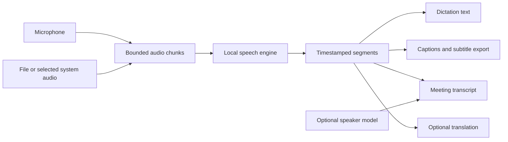

# Desktop feature plan

[Desktop roadmap](desktop-roadmap.md) · [User guide](user-guide.md) · [Microphone help](microphone-troubleshooting.md)

Scope: Windows, macOS and Linux. Mobile has a separate [keyboard roadmap](mobile-roadmap.md);
these modes are not promises of Android or iOS availability.

Updated September 12, 2026. This is a development plan, not a list of available
features or promised release dates. Microphone open recovery is included in v0.3.4;
continuous recording and expanded file transcription are included in the
0.4.6 RC1 Windows preview. Live captions, meetings and the other larger modes remain planned.
File transcription and export first became available in desktop v0.4.0 and are
not in older v0.3.8 downloads.

## First: reliable capture and comfortable long takes

| Work | Status | Acceptance criteria |
| --- | --- | --- |
| Windows shared microphone access | v0.3.4 | WASAPI shared mode for the system default or an unambiguously matching named endpoint; other platforms retain their capture backend. |
| Temporary open failures | v0.3.4 | Close failed streams, retry device-unavailable once, keep other errors actionable, reset toggle state on failure. |
| Missing selected microphone | v0.3.8 | Exact saved name required; no partial-name or default fallback. Refresh preserves selection and explains recovery. Identical hardware names remain a limitation. |
| Device loss during recording | v0.4.0 | Detect stopped streams or 3 seconds without callbacks; preserve captured speech for explicit recovery without automatic insertion. Silence remains valid. Native hotplug/timeout evidence pending. |
| Reconnect and permission recovery | Planned | Refresh devices, show selected/actual input, retry without restart; never change system permissions automatically. |
| Continuous hold/toggle recording | 0.4.6 RC1 preview | No scheduled duration cutoff; authorized local temporary storage, a bounded write queue and recognition windows preserve samples and order. Stop, Esc, quit and incomplete-result recovery remain explicit. |
| Optional stop after speech | 0.4.6 RC1 preview | A locally reviewed detector can stop an explicitly started take after a selected 0.5–3 second pause. Review is the default; automatic insertion is separate and target-guarded. |

The current retry adds 150 ms only after PortAudio reports device unavailable.
It does not wait indefinitely or force another application to release its input.
Native contention, reconnect, Bluetooth, sleep/wake, and permission tests remain
release gates for broader recovery claims.

The RC1 preview treats long dictation as an audio-pipeline change, not merely a
deleted timer. Explicitly authorized audio uses a local temporary file, an 8 MiB
pending-write bound and recognition windows of at most 30 seconds. The recorder
keeps only a short preview/endpoint tail in memory. Quiet-boundary batching retains
every sample once and preserves order; it does not infer or delete repeated words.
Storage/queue failure produces an incomplete recovery result instead of a
complete-looking paste. Temporary files are removed on owned cleanup, without an
encryption or secure-erasure claim. Physical microphone endurance, full-process
memory and broader long-speech accuracy remain prerelease limits.

## Shared foundation for new modes

This diagram describes the broader planned architecture. Desktop v0.4.0 adds
structured start/end segments alongside the unchanged string dictation API.
Keep spoken edit commands out of captions and meeting transcripts: someone saying
“scratch that” in a video must not trigger an edit to the user's document.

## Build order

1. **File transcription and subtitle export.** Open supported audio/video, show
   progress and cancellation, export TXT/SRT/VTT, preserve timestamps, and test
   long files and malformed input. Version 0.4.0 supports bounded integer PCM WAV
   in packaged builds without adding codecs; source installations with PyAV support
   additional media. See [scope and limits](desktop-file-transcription.md).
2. **Live captions.** Select system audio, with explicit start/stop and a movable,
   resizable caption window. Keep provisional words visually distinct from final
   text; test delay and revisions. Start with Windows capture, then validate
   platform adapters separately. Never enable an overlay merely because the app starts.
3. **Meeting transcripts.** Deliberately capture microphone plus meeting audio,
   synchronize sources, prevent echo/duplicate speech, and support pause, bookmarks,
   export, and discard. Test a full hour with bounded memory. No calendar access or
   meeting bot is required for the first version.
4. **Speaker labels.** Start with Speaker 1/2 and manual names. Keep separate input
   tracks when available. Measure overlaps, short interjections, and label changes;
   consider a post-session refinement pass before claiming reliable live labels.
   Persistent voice identification is not part of this initial feature.
5. **Translated captions.** Multilingual Whisper can translate to English; other
   target languages need a separate local model. Offer original/translated text
   together and measure added latency, names, negation, and language switching.
6. **Optional local meeting summaries.** Later evaluation only: link summaries
   and action items to transcript timestamps, allow correction, and avoid treating
   generated claims as facts. Do not silently bundle a large language model.

## Model and product constraints

The default English-only model does not cover multilingual translation. Optional
models must have clear size, hardware, licensing, and download requirements.
[Whisper](https://github.com/openai/whisper) documents its language/task support.
[pyannote Community-1](https://huggingface.co/pyannote/speaker-diarization-community-1)
is one offline-capable speaker-label candidate, but its initial access conditions
create setup friction; it is not yet selected. Evaluate dependency telemetry and
network behavior as well as inference accuracy.

Use a consented or public audio corpus. Release evidence must cover real audio,
speaker overlap, silence, timestamps, export validity, memory, cancellation,
and native capture. Unit tests and synthetic latency samples alone are insufficient.

## Documentation and imagery with every feature

- Update the user guide and troubleshooting instructions when behavior changes.
- Keep version status explicit: implemented locally, merged, and published are distinct.
- Replace affected screenshots using the real app and sample content. Remove obsolete
  references instead of appending another gallery to the README.
- Use Utterling for welcome, instructions, and meaningful status. Use diagrams to
  explain capture and data flow; do not present planned screens as working features.
- Keep the README short. Detailed platform setup, model choices, and developer notes
  belong in their linked guides.
