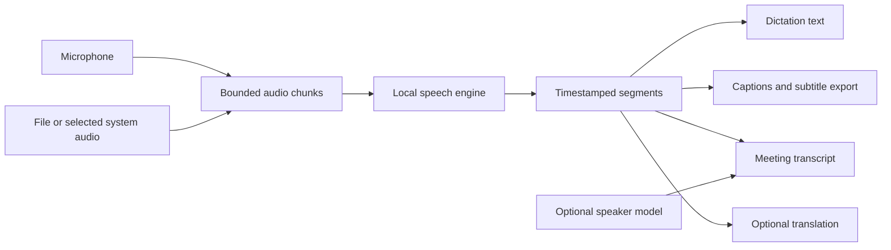

# What grows next

[Roadmap](roadmap.md) · [User guide](user-guide.md) · [Microphone help](microphone-troubleshooting.md)

Updated September 9, 2026. This is a development plan, not a list of available
features or promised release dates. Microphone open recovery is included in v0.3.4;
the larger modes below remain planned.

## First: reliable capture and comfortable long takes

| Work | Status | Acceptance criteria |
| --- | --- | --- |
| Windows shared microphone access | v0.3.4 | WASAPI shared mode for the system default or an unambiguously matching named endpoint; other platforms retain their capture backend. |
| Temporary open failures | v0.3.4 | Close failed streams, retry device-unavailable once, keep other errors actionable, reset toggle state on failure. |
| Missing selected microphone | v0.3.8 | Exact saved name required; no partial-name or default fallback. Refresh preserves selection and explains recovery. Identical hardware names remain a limitation. |
| Device loss during recording | Planned | Detect a stopped stream or missing callbacks; preserve captured speech; explain interruption without treating quiet audio as device failure. |
| Reconnect and permission recovery | Planned | Refresh devices, show selected/actual input, retry without restart; never change system permissions automatically. |
| Hold until release | Planned | Replace the 120-second hold-mode cutoff with bounded incremental processing; preserve words and order across boundaries. |
| Optional toggle-session limit | Planned | Configurable duration; countdown only when limited, optional elapsed time otherwise. |

The current retry adds 150 ms only after PortAudio reports device unavailable.
It does not wait indefinitely or force another application to release its input.
Native contention, reconnect, Bluetooth, sleep/wake, and permission tests remain
release gates for broader recovery claims.

Long dictation is an audio-pipeline change, not simply deleting a timer. The
current engine serializes final decoding, and the recorder holds an entire take
in memory. The replacement needs bounded audio chunks, overlapping context,
duplicate removal, ordered output, cancellation, and backpressure when decoding
cannot keep up. No silent disk spooling. Define explicit user choices before any
temporary audio persistence is introduced.

## Shared foundation for new modes

This diagram describes the planned architecture. Today `CTranslateEngine.transcribe`
joins segment text into one string. Introduce a structured segment result with
start/end times and a compatibility adapter for existing dictation callers.
Keep spoken edit commands out of captions and meeting transcripts: someone saying
“scratch that” in a video must not trigger an edit to the user's document.

## Build order

1. **File transcription and subtitle export.** Open supported audio/video, show
   progress and cancellation, export TXT/SRT/VTT, preserve timestamps, and test
   long files and malformed input. Packaged builds currently exclude PyAV/FFmpeg;
   review the decoder, licenses, and distribution size before adding file support.
2. **Live captions.** Select system audio, with explicit start/stop and a movable,
   resizable caption window. Keep provisional words visually distinct from final
   text; test delay and revisions. Start with Windows capture, then validate
   platform adapters separately. Never enable an overlay merely because the app starts.
3. **Meeting transcripts.** Deliberately capture microphone plus meeting audio,
   synchronize sources, prevent echo/duplicate speech, and support pause, bookmarks,
   export, and discard. Test a full hour with bounded memory. No calendar access or
   meeting bot is required for the first version.
4. **Speaker labels.** Start with Speaker 1/2 and manual names. Keep separate input
   tracks when available. Measure overlaps, short interjections, and label changes;
   consider a post-session refinement pass before claiming reliable live labels.
   Persistent voice identification is not part of this initial feature.
5. **Translated captions.** Multilingual Whisper can translate to English; other
   target languages need a separate local model. Offer original/translated text
   together and measure added latency, names, negation, and language switching.
6. **Optional local meeting summaries.** Later evaluation only: link summaries
   and action items to transcript timestamps, allow correction, and avoid treating
   generated claims as facts. Do not silently bundle a large language model.

## Model and product constraints

The default English-only model does not cover multilingual translation. Optional
models must have clear size, hardware, licensing, and download requirements.
[Whisper](https://github.com/openai/whisper) documents its language/task support.
[pyannote Community-1](https://huggingface.co/pyannote/speaker-diarization-community-1)
is one offline-capable speaker-label candidate, but its initial access conditions
create setup friction; it is not yet selected. Evaluate dependency telemetry and
network behavior as well as inference accuracy.

Use a consented or public audio corpus. Release evidence must cover real audio,
speaker overlap, silence, timestamps, export validity, memory, cancellation,
and native capture. Unit tests and synthetic latency samples alone are insufficient.

## Documentation and imagery with every feature

- Update the user guide and troubleshooting instructions when behavior changes.
- Keep version status explicit: implemented locally, merged, and published are distinct.
- Replace affected screenshots using the real app and sample content. Remove obsolete
  references instead of appending another gallery to the README.
- Use Utterling for welcome, instructions, and meaningful status. Use diagrams to
  explain capture and data flow; do not present planned screens as working features.
- Keep the README short. Detailed platform setup, model choices, and developer notes
  belong in their linked guides.
