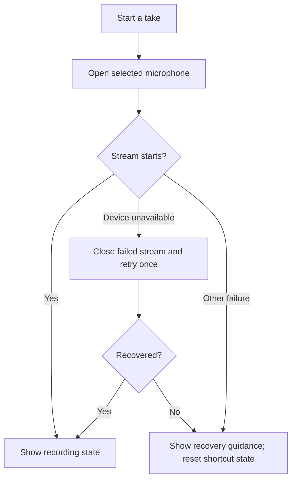

# When the microphone will not cooperate

[User guide](user-guide.md) · [Installation](installation.md) · [Roadmap](roadmap.md)

## Try this first

1. Open **Settings → Dictation** and check **Input device**. Reconnect a USB mic
   or headset if necessary, then choose **Refresh devices**.
2. Run **Test microphone**. Wait for “Speak now” before talking.
3. If another audio app is using exclusive access, stop its capture or configure
   that app to share the device. Utterleaf cannot force-release another app's mic.
4. Check the operating system's microphone permission for desktop applications.
   Then retry the microphone check or dictation shortcut.

Utterleaf releases its microphone after each take. A green ready tray icon does
not mean audio is being captured. An opening failure is not evidence that a
particular app is responsible: disconnects, driver errors, and permissions can
produce similar symptoms.

## Windows: using Discord or another voice app

**Update to v0.4.3 if v0.4.2 still reports an error when opening the microphone.**
A Windows capture-thread initialization defect was reproduced with an AT2020 USB
microphone: opening on the main thread worked, while background-thread startup
failed with `PaErrorCode -9999`. The attached WDM-KS error text could be stale and
did not establish which backend or application caused the failure.

v0.4.3 opens, starts and releases Windows streams on a dedicated COM-initialized
thread. It closes that thread after releasing the microphone. This fixes the
reproduced thread-initialization path without changing Windows or Discord settings;
it does not claim to resolve every driver, permission or exclusive-access conflict.
See [Microsoft's COM threading requirements](https://learn.microsoft.com/en-us/windows/win32/api/combaseapi/nf-combaseapi-coinitializeex)
and [capture-interface ownership](https://learn.microsoft.com/en-us/windows/win32/api/audioclient/nn-audioclient-iaudiocaptureclient).

Shared-mode capture allows more than one application to use a microphone. Utterleaf
requests WASAPI shared mode when that backend is available; another app being open
does not by itself establish an exclusive-access conflict.

1. Select the same intended microphone explicitly in Utterleaf and your voice app.
   Avoid switching to a different physical input just to make the error disappear.
2. Press **Win+R**, enter `mmsys.cpl`, and open **Recording → your microphone →
   Properties → Advanced**. If exclusive access is enabled and you do not need it
   for recording software, clear **Allow applications to take exclusive control
   of this device**, then Apply. Reopen the affected voice applications. Some
   drivers do not expose this setting. This is a user-controlled Windows setting;
   Utterleaf does not change it automatically.
3. Under **Windows Settings → Privacy & security → Microphone**, check microphone
   access and **Let desktop apps access your microphone**. Permission failures
   require permission changes; repeated capture attempts cannot bypass them.
4. Run Utterleaf's **Test microphone** before joining a call, then again during
   the call. If it fails only during the call, note the exact status and whether
   leaving the call restores it. With Bluetooth headsets, also note whether the
   input device changes when the call starts.

If the device stops responding after a call or reconnect, finish/discard any take
and restart Utterleaf to refresh the audio backend. Do not restart Windows Audio
or disable unrelated microphones as a first troubleshooting step.

See Microsoft's [shared audio overview](https://learn.microsoft.com/en-us/windows/win32/coreaudio/user-mode-audio-components)
and [exclusive-mode controls](https://learn.microsoft.com/en-us/windows/win32/coreaudio/exclusive-mode-streams).

## If recording stops unexpectedly (v0.4.0)

Utterleaf checks whether the stream stopped or has sent no audio callbacks for
three seconds. Ordinary quiet audio is valid; pauses in speech do not trigger this
check. It releases the input and tries to recognize speech already captured,
including when the interruption occurs during the short recording tail.

Partial speech is **not inserted automatically**. If recovery succeeds, use
**Copy last dictation (2 min)** in the tray and paste it where you intended.
The recovery slot expires after two minutes; **Forget last dictation** clears it
immediately. Cancel suppresses an unfinished recovery. No recording is saved.

Reconnect the selected microphone and retry, or deliberately select another in
Settings. Utterleaf never silently substitutes a different microphone. Native
hotplug, Bluetooth, and permission behavior still depends on the platform/backend;
some backends require restarting after reconnecting.

## Opening recovery (since v0.3.4)

These changes are included in v0.3.4. Update if you are still using v0.3.3:

On Windows, the system default prefers WASAPI shared mode. A named microphone
switches backend only when an exact, unique WASAPI name match exists; otherwise
the existing selected backend is retained.

## Selected microphone protection (v0.3.8)

A saved microphone now requires an exact device-name match. If it is missing,
Utterleaf stops before opening any input and explains how to reconnect or choose
another microphone. It does not silently switch to the laptop microphone.
Older manually entered partial names must be replaced by a full name from the
Settings picker. **System default** remains an explicit choice that follows the
operating system's default input.

Refresh keeps a missing selection visible and reports its status. Try again
after reconnecting; some audio backends may require restarting Utterleaf before
a newly connected device appears. Identical device names cannot distinguish
physical microphones; stable hardware identifiers remain future work.

Since v0.4.2, PortAudio device-unavailable and recognized Windows WASAPI
device-in-use, device-invalidated and resources-invalidated errors receive one
retry after 150 ms. Failed streams are closed first. Windows permission and
unsupported-format errors have separate guidance and are not retried. Unknown
host errors are not treated as permission or sharing failures by guesswork.
The Settings microphone check also detects a stopped or stalled stream instead
of reporting success from audio received earlier in the check.

Format and other errors are reported directly;
Utterleaf does not change OS settings. Robust device hotplug re-enumeration remains
future work; interrupted-recording recovery is described above.

Windows shared and exclusive access are described in [Microsoft's audio
documentation](https://learn.microsoft.com/en-us/windows/win32/api/audiosessiontypes/ne-audiosessiontypes-audclnt_sharemode).
An exclusive connection can interrupt shared audio; see [device recovery](https://learn.microsoft.com/en-us/windows/win32/coreaudio/recovering-from-an-invalid-device-error).
