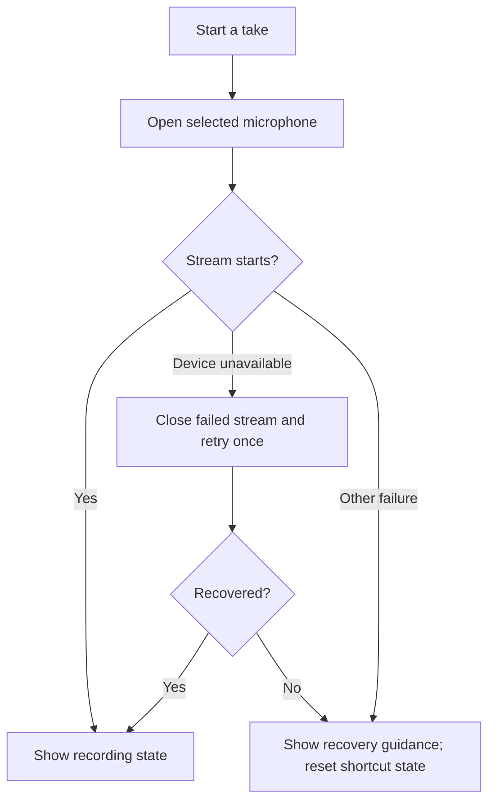

# When the microphone will not cooperate

[User guide](user-guide.md) · [Installation](installation.md) · [Roadmap](roadmap.md)

## Try this first

1. Open **Settings → Dictation** and check **Input device**. Reconnect a USB mic
   or headset if necessary, then choose **Refresh devices**.
2. Run **Test microphone**. Wait for “Speak now” before talking.
3. If another audio app is using exclusive access, stop its capture or configure
   that app to share the device. Utterleaf cannot force-release another app's mic.
4. Check the operating system's microphone permission for desktop applications.
   Then retry the microphone check or dictation shortcut.

Utterleaf releases its microphone after each take. A green ready tray icon does
not mean audio is being captured. An opening failure is not evidence that a
particular app is responsible: disconnects, driver errors, and permissions can
produce similar symptoms.

## Recovery in v0.3.4

These changes are included in v0.3.4. Update if you are still using v0.3.3:

On Windows, the system default prefers WASAPI shared mode. A named microphone
switches backend only when an exact, unique WASAPI name match exists; otherwise
the existing selected backend is retained. The older device resolver still
supports partial names and falls back to the system default for a missing saved
name; explicit missing-device handling remains planned work.

Only PortAudio's device-unavailable error receives one retry, after 150 ms.
Failed streams are closed first. Format and other errors are reported directly;
Utterleaf does not change OS settings. Interrupted recording recovery and robust
device hotplug re-enumeration are not implemented by this change.

Windows shared and exclusive access are described in [Microsoft's audio
documentation](https://learn.microsoft.com/en-us/windows/win32/api/audiosessiontypes/ne-audiosessiontypes-audclnt_sharemode).
An exclusive connection can interrupt shared audio; see [device recovery](https://learn.microsoft.com/en-us/windows/win32/coreaudio/recovering-from-an-invalid-device-error).
