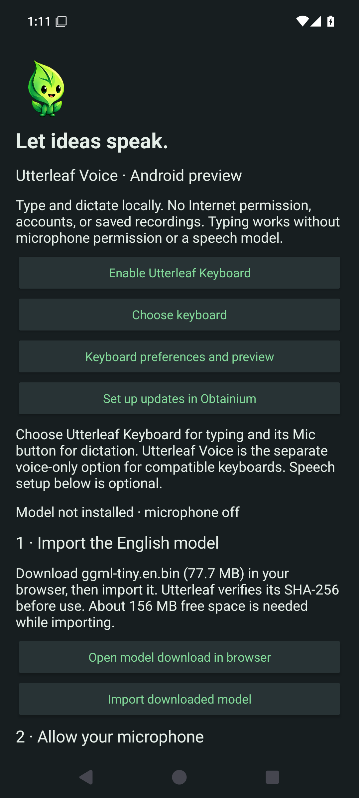
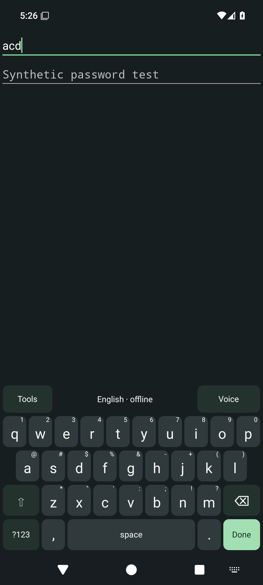

# Utterleaf on phones

[Documentation](README.md) · [Mobile roadmap](mobile-roadmap.md) · [Android preview](../mobile/android/README.md)

Mobile development follows the same priority as desktop: security first, privacy
second, convenience third. The Android project is a separate native application;
it does not replace or add dependencies to the desktop Python application.

## Android — typing and local dictation preview

[Download the signed Android alpha09 APK](https://github.com/RioPlay/utterleaf/releases/download/android-v0.1.0-alpha09/Utterleaf-Android-0.1.0-alpha09.apk) ·
[Release notes](https://github.com/RioPlay/utterleaf/releases/tag/android-v0.1.0-alpha09) ·
[Setup and current limits](../mobile/android/README.md)

Android **0.1.0-alpha09 is released as a signed preview**. Setup
separates the two keyboard activation steps from optional voice setup, reports
whether the keyboard is enabled and selected, and shows model and microphone
permission status independently.

Alpha09 adds one primary voice action, immediate recording from the keyboard's
**Voice** button, local transcript editing and optional hold-to-insert. It also
adds Shift-space selection, held deletion, period-key punctuation and independent
height/bottom spacing with a private practice editor.
[Validation and limits](android-keyboard-design.md#released-in-alpha09).

Alpha07 adds hold–slide–release accent selection and spacebar cursor movement.
Hold a letter, slide to the highlighted choice and release; slide away to cancel.
Use **Tools → Accents → letter** for a tap-only route.
[Validation and picker screenshots](android-keyboard-design.md#released-in-alpha07)
cover 8 JVM, 44 emulator and 3 release-contract tests plus signed installation checks.

Alpha05 adds a staggered everyday layout with a wide spacebar,
direct punctuation and **Voice**/**Tools** controls. Preferences offer an optional
number row and terminal controls alongside larger keys/labels, light/dark keys,
vibration and repeat filtering. Terminal controls include Esc, Tab, one-shot
Ctrl/Alt, arrows, Home/End and Page Up/Down. The Fn layer replaces letters with
F1–F12, Insert and forward Delete. Editors can handle
these keys differently; real-terminal and phone compatibility remain acceptance
work. Suggestions, correction and swipe typing are still planned.

Typing works without microphone permission or a speech model. For optional
English dictation, choose **tiny.en (77.7 MB)**,
**base.en (148.0 MB)** or **small.en (487.6 MB)**. Use the browser download and then
choose **Import a model**. The file is identified independently of the download
selector; only exact reviewed sizes and SHA-256 hashes are
accepted. One model is active, and a failed import keeps the existing model.
See [direct model links, hashes and setup](../mobile/android/README.md#english-speech-models).
Small.en inference and phone performance are not yet verified.

Speech previews have an expiry warning and **Keep reviewing**. Setup retains
the [Obtainium configuration button](mobile-obtainium.md); using a separate
voice-only input method is now explained under optional advanced setup.

The native Kotlin app uses Android's input-method framework and local whisper.cpp
inference. A separate voice-only IME and speech-recognition activity remain available
for compatible callers. This is an early keyboard foundation; multilingual layouts,
prediction and broader accessibility/device coverage remain on the
[mobile roadmap](mobile-roadmap.md).

Existing alpha01/alpha02 users need a one-time uninstall because those builds used
different debug signing keys. Uninstalling removes app data and the imported model;
install alpha09 and import the model again. Alpha03 began the persistent signing
channel, which alpha09 retains. See [migration details](mobile-obtainium.md#migrating-from-the-old-alpha).

See the [Android guide](../mobile/android/README.md) for exact implemented scope,
setup, permissions, test evidence and remaining native-device acceptance work.
Build success alone does not establish keyboard compatibility or phone usability.
Desktop vocabulary and spoken-command behavior have not yet been ported.

Actual alpha07 ee47aa7 on the API 35 CI emulator. Setup scrolls; the
keyboard is shown in a synthetic test editor with no personal text or recording.
Status and navigation bars are clear of the app controls. Instrumentation temporarily
allows the debug capture and restores the secure flag; release IME windows remain
protected. These images do not establish phone or accessibility acceptance.

### Android validation — September 9, 2026

Alpha05 **f74b862 passed 4 JVM tests, 32 API 35 emulator tests and
3 Python release-contract tests** in [CI run 34432378047](https://github.com/RioPlay/utterleaf/actions/runs/34432378047).
The emulator report has **zero failures and zero skips**. Both tiny.en and base.en
completed real local inference on the pinned JFK speech fixture. New checks cover
model selection/bounds/rollback, setup choices, terminal key-event contracts,
one-shot modifiers, number-row independence, the replacing Fn layer and system-bar
bounds. The reviewed screenshots above come from that run. Terminal dispatch tests
use controlled editor connections; they do not certify Termux, SSH or remote editors.
Small.en inference remains unverified.

The [successful alpha05 signing/publishing run](https://github.com/RioPlay/utterleaf/actions/runs/34432995380)
verified the stable signing certificate, upgraded signed alpha03 to alpha05 on an
emulator, reinstalled the same alpha05 version and launched setup. It did not test
preference or imported-model retention. Physical and real Obtainium updates remain open.

The historical alpha04 baseline passed **4 JVM tests, 11 API 35 emulator tests and 3 Python release-contract
tests** in the [verified CI run](https://github.com/RioPlay/utterleaf/actions/runs/34427672686).
Coverage includes
hash rejection for same-size untrusted models, packaged permission/backup checks,
denied microphone access, password-field filtering, auxiliary voice subtype
discovery, stale-result rejection, single insertion, actual whisper.cpp
transcription of the pinned JFK speech fixture, and foreground microphone
capture/cancellation, typing-panel behavior, keyboard service protection and the
preferences preview. The added live-IME test exercises letter entry, cursor movement,
deletion, the Done action, switching from the voice panel to a password field, and
keyboard dismissal/reopening in an emulator test activity. It starts no microphone
capture. A separate direct typing-panel button test verifies Shift/Caps behavior.
Selected-text replacement remains an acceptance task. ARM64 and x86_64 debug/release
APKs compile; Android lint
passes its error gate. Remaining warnings include English UI localization and
newer dependency versions. The [successful alpha04 signing/publishing run](https://github.com/RioPlay/utterleaf/actions/runs/34428171272)
verified the release signature, upgraded signed alpha03 to alpha04 on an emulator,
and reinstalled the same alpha04 version before publication. Alpha04 retains the
alpha03 signing certificate. Preference and imported-model preservation were not
exercised by that upgrade test; physical version-to-version updates remain open.

Native optimization reduced the fixture test from about 4m18s to 33s on separate
hosted emulator runs. These times include model import/verification/loading and
are **not a controlled benchmark or a prediction of phone dictation latency**.
Physical ARM64 speed, battery use, real-editor keyboard interoperability, TalkBack,
Switch Access and interruption tests remain open. Real Obtainium import/updates
and an independently protected offline signing-key backup are separate acceptance
gates. See the
[Android CI reports](https://github.com/RioPlay/utterleaf/actions/workflows/android.yml).

## iOS — feasibility gate before promising keyboard dictation

Apple's [keyboard extension documentation](https://developer.apple.com/library/archive/documentation/General/Conceptual/ExtensibilityPG/CustomKeyboard.html)
states that extensions cannot access the microphone. A full custom keyboard does
not remove that restriction. Apple's
[interface guidance](https://developer.apple.com/documentation/uikit/configuring-a-custom-keyboard-interface)
describes containing-app integration but does not establish a universal replacement
for another keyboard's microphone provider.

The first iOS milestone should be a native foreground recording application with
local inference and explicit copy/share. Before adding a keyboard extension, prove
a supported containing-app handoff on a physical iPhone, review current App Store
rules, and measure lifecycle behavior. Do not use private APIs or keep a microphone
session alive between takes simply to make switching feel seamless.

No iOS application or keyboard extension is implemented in this Android pass.
The shared native inference option has upstream
[Android and iOS examples](https://github.com/ggml-org/whisper.cpp), but each platform
still needs its own permission, audio, UI, and delivery tests.
