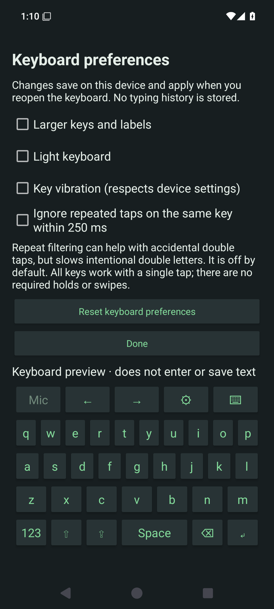

# Utterleaf on phones

[Documentation](README.md) · [Mobile roadmap](mobile-roadmap.md) · [Android preview](../mobile/android/README.md)

Mobile development follows the same priority as desktop: security first, privacy
second, convenience third. The Android project is a separate native application;
it does not replace or add dependencies to the desktop Python application.

## Android — typing and local dictation preview

[Download the signed Android alpha03 APK](https://github.com/RioPlay/utterleaf/releases/download/android-v0.1.0-alpha03/Utterleaf-Android-0.1.0-alpha03.apk) ·
[Release notes](https://github.com/RioPlay/utterleaf/releases/tag/android-v0.1.0-alpha03) ·
[Setup and current limits](../mobile/android/README.md)

Android **0.1.0-alpha03 is released** with an English typing keyboard and integrated
local dictation. Typing works without a speech model or microphone permission.
Preferences offer larger keys/labels, light or dark keys, optional vibration and
repeat filtering; speech previews have an expiry warning and **Keep reviewing**.
Setup includes an [Obtainium configuration button](mobile-obtainium.md).

The native Kotlin app uses Android's input-method framework and local whisper.cpp
inference. A separate voice-only IME and speech-recognition activity remain available
for compatible callers. This is an early keyboard foundation; multilingual layouts,
prediction and broader accessibility/device coverage remain on the
[mobile roadmap](mobile-roadmap.md).

Existing alpha01/alpha02 users need a one-time uninstall because those builds used
different debug signing keys. Uninstalling removes app data and the imported model;
install alpha03 and import the model again. See [migration details](mobile-obtainium.md#migrating-from-the-old-alpha).

See the [Android guide](../mobile/android/README.md) for exact implemented scope,
setup, permissions, test evidence and remaining native-device acceptance work.
Build success alone does not establish keyboard compatibility or phone usability.
Desktop vocabulary and spoken-command behavior have not yet been ported.

Actual alpha03 CI app on an API 35 emulator. The setup and preferences pages scroll;
the keyboard shown is the preferences preview, which does not enter or save text.
No recording or personal transcript is shown. IME windows protect their contents
from screenshots. These images do not establish physical accessibility coverage.

### Android validation — September 9, 2026

Alpha03 passes **4 JVM tests, 10 API 35 emulator tests and 3 Python release-contract
tests**. Coverage includes
hash rejection for same-size untrusted models, packaged permission/backup checks,
denied microphone access, password-field filtering, auxiliary voice subtype
discovery, stale-result rejection, single insertion, actual whisper.cpp
transcription of the pinned JFK speech fixture, and foreground microphone
capture/cancellation, typing-panel behavior, keyboard service protection and the
preferences preview. ARM64 and x86_64 debug/release APKs compile; Android lint
passes its error gate. Remaining warnings include English UI localization and
newer dependency versions. The [successful signing/publishing run](https://github.com/RioPlay/utterleaf/actions/runs/34425184566)
verified the release signature and signed-APK installation/reinstallation before
publishing alpha03. This does not establish a physical version-to-version update.

Native optimization reduced the fixture test from about 4m18s to 33s on separate
hosted emulator runs. These times include model import/verification/loading and
are **not a controlled benchmark or a prediction of phone dictation latency**.
Physical ARM64 speed, battery use, real-editor keyboard interoperability, TalkBack,
Switch Access and interruption tests remain open. Real Obtainium import/updates
and an independently protected offline signing-key backup are separate acceptance
gates. See the
[Android CI reports](https://github.com/RioPlay/utterleaf/actions/workflows/android.yml).

## iOS — feasibility gate before promising keyboard dictation

Apple's [keyboard extension documentation](https://developer.apple.com/library/archive/documentation/General/Conceptual/ExtensibilityPG/CustomKeyboard.html)
states that extensions cannot access the microphone. A full custom keyboard does
not remove that restriction. Apple's
[interface guidance](https://developer.apple.com/documentation/uikit/configuring-a-custom-keyboard-interface)
describes containing-app integration but does not establish a universal replacement
for another keyboard's microphone provider.

The first iOS milestone should be a native foreground recording application with
local inference and explicit copy/share. Before adding a keyboard extension, prove
a supported containing-app handoff on a physical iPhone, review current App Store
rules, and measure lifecycle behavior. Do not use private APIs or keep a microphone
session alive between takes simply to make switching feel seamless.

No iOS application or keyboard extension is implemented in this Android pass.
The shared native inference option has upstream
[Android and iOS examples](https://github.com/ggml-org/whisper.cpp), but each platform
still needs its own permission, audio, UI, and delivery tests.
