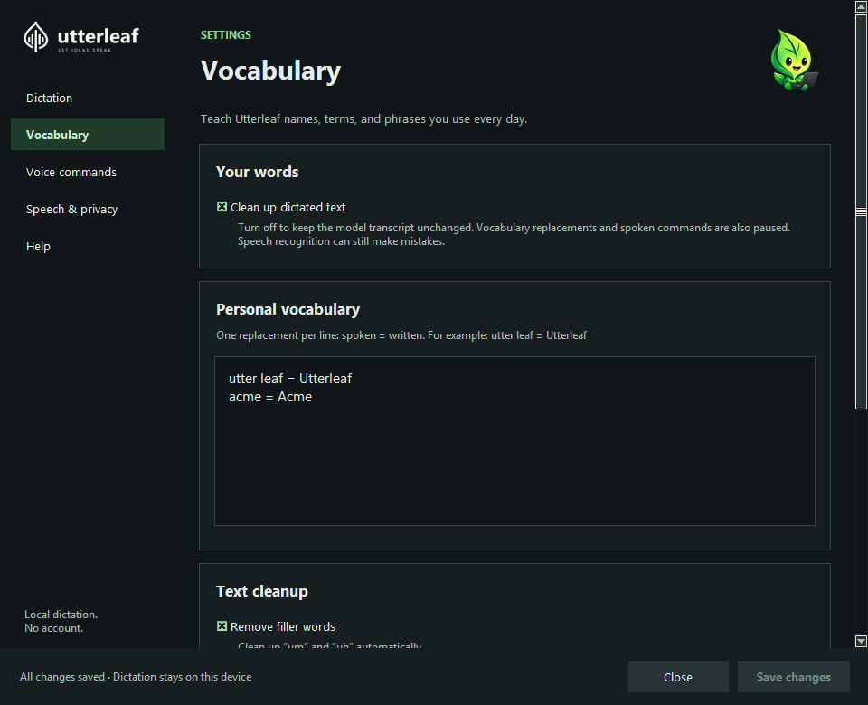
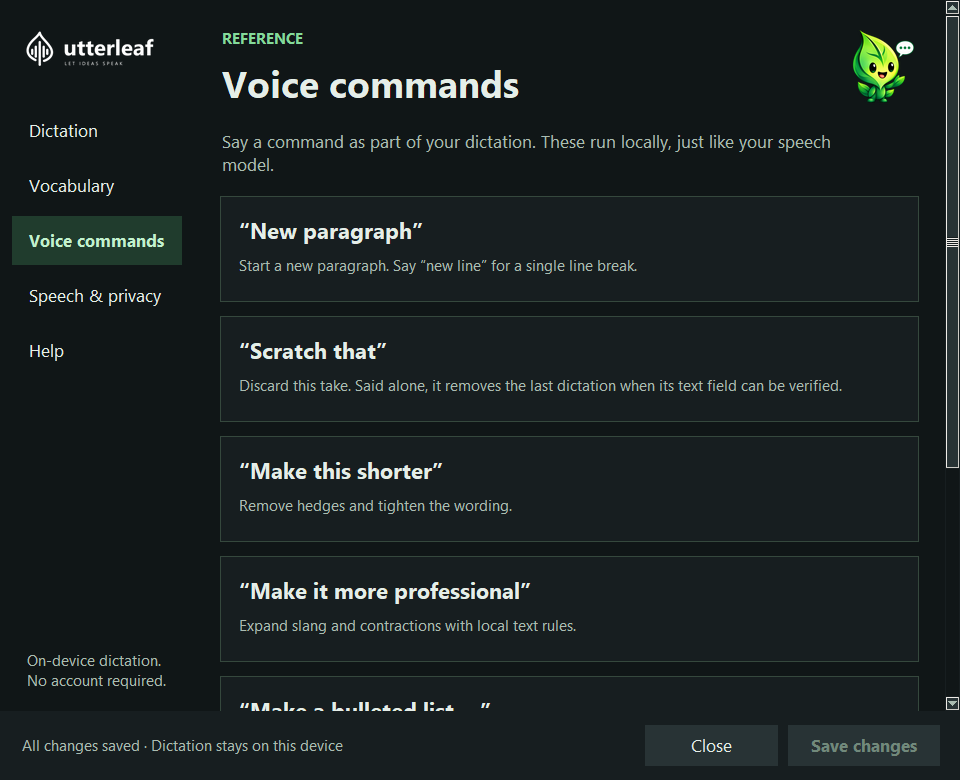

# A look inside Utterleaf

[Back to Utterleaf](../README.md) · [User guide](user-guide.md)

These are real screenshots of the current Windows development version, captured
with sample vocabulary. The latest downloadable release may look different.

## Dictation

Choose a shortcut, select your microphone, and check that Utterleaf can hear you.

## Vocabulary

Teach Utterleaf the names and phrases you use every day. Typing Utterling keeps
you company while you make the words your own.

## Voice commands

Find the words for punctuation, lists, and editing. Speaking Utterling marks the
place to learn what you can say.

