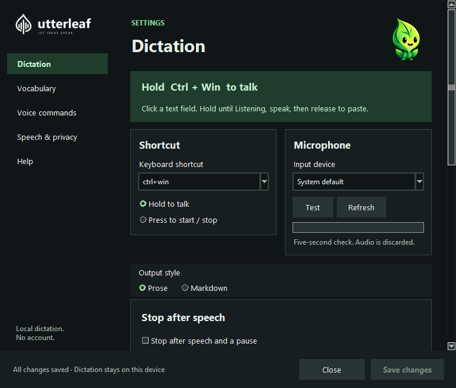
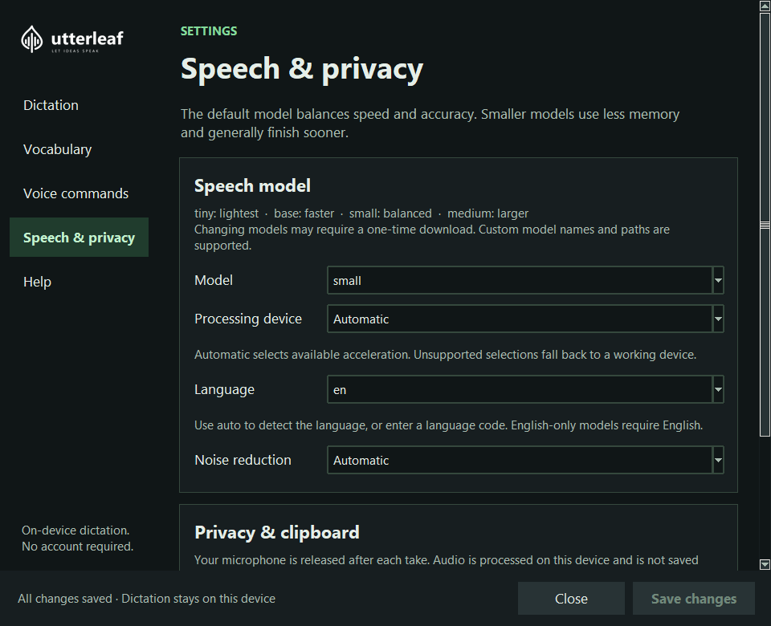
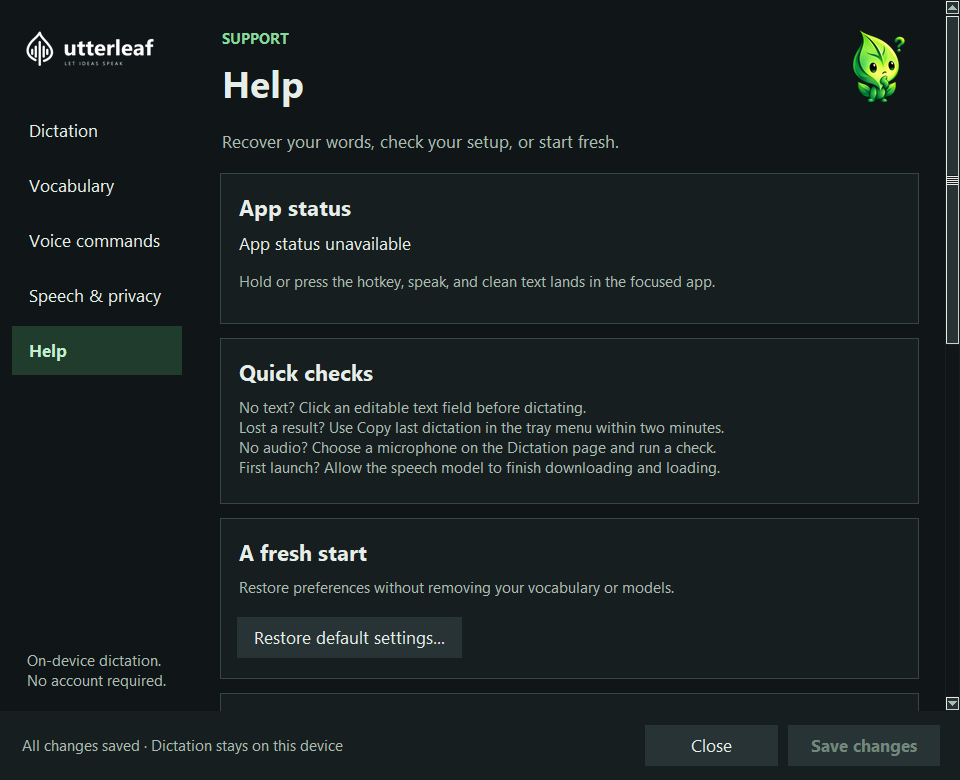

# A look inside Utterleaf

[Back to Utterleaf](../README.md) · [User guide](user-guide.md)

Real Windows screenshots captured with sample settings and vocabulary.
Dictation and Vocabulary show the September 13 source layout, after the published
Windows RC2 preview. Speech & privacy shows v0.4.1; the other screens show v0.3.7.
The app uses bundled artwork and local fonts; no remote content is loaded by Settings.

## Dictation

Choose a shortcut, select your microphone, and check that Utterleaf can hear you.
The source layout groups activation with the shortcut and moves Output style to
Dictation. The published RC2 keeps Output style under Vocabulary.

At 770 × 655 with default Windows font metrics, the everyday controls and optional
speech-end toggle remain visible. Larger text can stack the two input groups;
the page scrolls while Save and Close stay visible. These source captures do not
establish physical display-scaling or screen-reader acceptance.

## Vocabulary

Teach Utterleaf the names and phrases you use every day. Typing Utterling keeps
you company while you make the words your own.

## Speech and privacy

Choose your model and hardware, then review download and clipboard preferences
in their own section. Default Settings stay dark and the floating indicator is opt-in.

## Voice commands

Find the words for punctuation, lists, and editing. Speaking Utterling marks the
place to learn what you can say.

## Help and recovery

Restore default settings, check your device, and find recovery instructions in
one place. Defaults are staged for review before saving; vocabulary and installed
models remain available.

