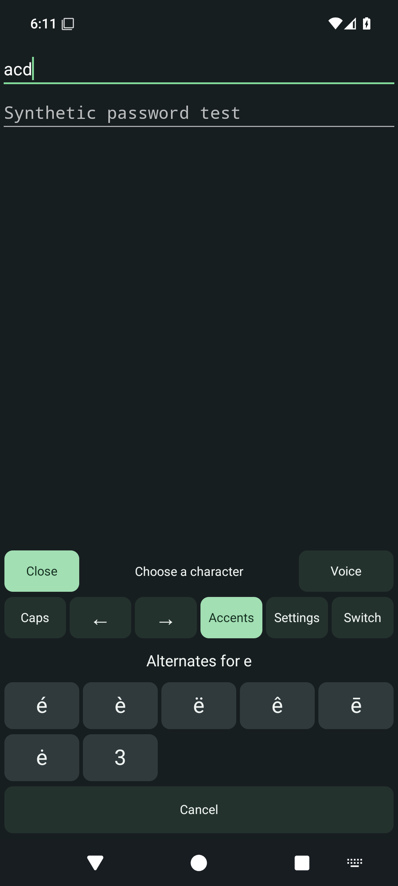

# Utterleaf for Android


An experimental English typing keyboard with integrated offline dictation.
**0.1.0-alpha13 is released as a signed development preview.**

Alpha12 introduced **Edit** opens Undo, Redo, Select all, Cut, Copy, Paste and
navigation in a panel that replaces the letters. **ABC** returns to typing.
[Validation and editor limits](../../docs/android-quick-actions.md).

New in alpha13: tuning sliders include their current value in
accessible descriptions, and quick toggles refresh other saved preferences.
Revision `d942098` passed 76 emulator tests, 8 JVM tests, lint, builds and release
contracts in [Android CI](https://github.com/RioPlay/utterleaf/actions/runs/34513111803).
Physical-device and TalkBack acceptance remain open. See the [design notes](../../docs/android-keyboard-design.md#released-in-alpha13).

Alpha11 added the single-row toolbar with **123** (number row),
**>_** (terminal controls) and the Utterleaf dictation icon. Quick toggles save
locally and stay synchronized with the Settings preview. Voice review supports
**Expand transcript**, scrolling, selection and **Edit transcript**; recording
preferences hide while reviewing. These changes passed 71 emulator tests;
physical-device and accessibility acceptance remain open. See
[alpha11 validation and screenshots](../../docs/android-keyboard-design.md#released-in-alpha11).

Typing works without microphone permission or a speech
model. A separate voice-only option remains available for compatible keyboards.

Alpha10 adds held Ctrl/Alt shortcuts in Terminal controls, independently configurable
delete repetition, and switching between retained model imports. See
[release validation and limits](../../docs/android-keyboard-design.md#released-in-alpha10).

Alpha09 adds Shift-space selection, held deletion, period-key punctuation,
independent height/bottom spacing and private layout practice. The voice panel
offers one primary control, local transcript editing and optional hold-to-insert.
[Validation and current limits](../../docs/android-keyboard-design.md#released-in-alpha09).

This is the foundation for a complete customizable keyboard. Broader language,
prediction, accessibility and device coverage remain on the
[mobile roadmap](../../docs/mobile-roadmap.md). Desktop development is tracked separately.

## Alpha07

- Visible secondary symbols on letters; hide hints in preferences if desired.
- Hold a letter, slide to a highlighted accent/symbol and release to insert.
  Slide away to cancel, or use **Tools → Accents → letter** for a tap-only route.
  Slide the spacebar horizontally to move the cursor; tap to insert a space.
  Cancel inserts nothing; Shift/Caps affect the choices. Old picker callbacks cannot
  insert into a later field. Adjustable hold timing and full language support remain planned.

- Staggered English letter rows, a wide spacebar, direct punctuation, symbols,
  deletion, Enter actions and integrated **Voice** and **Tools** controls.
- Shift/Caps handling carries forward the alpha04 fix: letters follow the displayed case, one-shot
  Shift clears after successful entry, and Shift reverses Caps Lock for one letter.
- Local keyboard preferences: larger keys/labels, light/dark keys, optional vibration
  and repeat filtering, with a preview and reset. Optional number-row and terminal
  preferences are independent. Terminal controls include Esc, Tab, one-shot Ctrl/Alt,
  four arrows, Home/End and Page Up/Down. Fn replaces letters with F1–F12, Insert
  and forward Delete, keeping panel height stable. Actual shortcut behavior
  depends on the receiving editor; broad terminal compatibility is unverified.
  Repeat filtering is off by default;
  enabling it suppresses same-key taps within 250 ms, including fast double letters.
- Voice IME with explicit Speak, Stop, Insert, Discard, and return-to-keyboard actions.
- `ACTION_RECOGNIZE_SPEECH` activity for callers that request an activity result.
- Local English recognition using pinned whisper.cpp, ARM64 and x86_64 builds.
- A guided setup with real keyboard enabled/selected status and separate optional
  voice readiness. Choose one of three reviewed [English speech models](#english-speech-models)
  and use **Import a model**. Import identifies any supported file by exact size and
  SHA-256 independently of the browser download selector.
- No Internet permission, microphone foreground service, accessibility service,
  automatic clipboard writes, contacts access, analytics, backup, or saved audio history.
- Capture cancellation and preview clearing on field changes or panel dismissal;
  explicit speech insertion only. Password typing works in Utterleaf Keyboard;
  dictation is disabled there. The separate voice-only IME rejects password fields.
- 120-second capture bound and elapsed/remaining time; two-minute preview expiry
  with a 30-second warning and **Keep reviewing** to extend it.
- **Set up updates in Obtainium**, opening configuration in a separately installed
  Obtainium app. Utterleaf does not download or install updates itself.

## Try it

1. [Download and install Utterleaf Android alpha13](https://github.com/RioPlay/utterleaf/releases/download/android-v0.1.0-alpha13/Utterleaf-Android-0.1.0-alpha13.apk)
   on Android 8.0 or newer with a 64-bit ARM processor (ARM64).
   Use `Utterleaf-Android-0.1.0-alpha13.apk` from the [signed release](https://github.com/RioPlay/utterleaf/releases/tag/android-v0.1.0-alpha13).
   If alpha01/alpha02 is installed, its debug signer differs: uninstall it once,
   then install alpha13. Uninstalling removes the imported model and other app data.
   Alpha03 began the persistent signing channel; an installed signed alpha03 uses
   the same release identity and should be updated in place rather than uninstalled.
2. Open **Utterleaf Voice**. Under **Your keyboard**, enable **Utterleaf Keyboard**
   in Android settings, then choose it. Setup reports which step is still needed.
   You do not need to enable the separate **Utterleaf Voice** input method to use
   the typing keyboard's dictation button.
3. Open a text field and type. Use **Keyboard preferences and preview** in setup to
   change sizing, theme, number row, terminal controls, vibration or repeat filtering. Reopen the keyboard to apply
   saved preferences. The private practice field lets you try the layout without
   entering text into another app; it clears when you leave settings.
4. For optional dictation, open **Optional · offline voice** in setup. Choose a model
   below, open its download in your browser, then return and **Import** that file.
   Allow microphone permission. The voice status shows what is still missing;
   granting permission does not start recording.
5. In a non-password field, tap the **Utterleaf dictation icon** to start, talk, **Stop**, review, and
   **Insert**. Use **Edit transcript** to correct locally before insertion.
   Speak/Stop/Insert share one primary control. From the idle panel, optionally
   enable **Hold to speak and insert on release**; hold until recording starts,
   speak and release. It inserts after recognition; moving outside cancels.
   The separate voice provider still starts with **Speak**.
   **Keep reviewing** appears near expiry to extend the timeout; **Discard** clears it.
   **Back to keyboard** returns to typing in the integrated keyboard. In the separate
   voice-only IME, it returns to the previous input method where Android permits,
   otherwise opens the picker.
6. If you use Obtainium, open **Set up updates in Obtainium** and review its import
   configuration. See [update setup and signing identity](../../docs/mobile-obtainium.md).
   Actual device import and version-to-version Obtainium updates remain unverified.

## English speech models

Keep multiple imported models and change the active one in setup with **Use
tiny.en**, **Use base.en** or **Use small.en**. Their rows show **Active**,
**Installed** or **Not installed**. In an idle voice panel, the **Model** control
offers the installed choices when there is more than one. Switching is allowed
between takes, not during recording, processing or import.

**Fast** uses tiny.en, **Balanced** uses base.en, and **Larger** uses small.en.
These describe the intended tradeoff, not measured phone performance or a promise
of correctness. **Delete selected model** removes only that import. If you delete
the active model, select another installed model before dictating again.

Start with tiny.en for the smallest download. Larger models require more RAM and
processing time; accuracy and speed depend on your phone and speech. The native
engine currently uses English for all three choices. These are reviewed file
identities, not a claim of equal testing or measured phone performance.

| Browser download | Exact bytes | SHA-256 |
| --- | ---: | --- |
| [tiny.en · 77.7 MB](https://huggingface.co/ggerganov/whisper.cpp/resolve/main/ggml-tiny.en.bin) | 77,704,715 | `921e4cf8686fdd993dcd081a5da5b6c365bfde1162e72b08d75ac75289920b1f` |
| [base.en · 148.0 MB](https://huggingface.co/ggerganov/whisper.cpp/resolve/main/ggml-base.en.bin) | 147,964,211 | `a03779c86df3323075f5e796cb2ce5029f00ec8869eee3fdfb897afe36c6d002` |
| [small.en · 487.6 MB](https://huggingface.co/ggerganov/whisper.cpp/resolve/main/ggml-small.en.bin) | 487,614,201 | `c6138d6d58ecc8322097e0f987c32f1be8bb0a18532a3f88f734d1bbf9c41e5d` |

Sizes and hashes were checked against the publisher's Git LFS metadata for
[tiny.en](https://huggingface.co/ggerganov/whisper.cpp/raw/main/ggml-tiny.en.bin),
[base.en](https://huggingface.co/ggerganov/whisper.cpp/raw/main/ggml-base.en.bin) and
[small.en](https://huggingface.co/ggerganov/whisper.cpp/raw/main/ggml-small.en.bin).
Use these original files; other languages, quantizations and arbitrary models are
not accepted. A computer-to-phone file transfer also works.

Allow roughly twice the download size in free storage for the browser's copy and
the verified import: about **156 MB**, **296 MB** or **976 MB** respectively. One
model is active at a time; retained imports use additional storage. Selecting a row
changes the browser link; **Use** switches to that installed model. New imports
become active only after verification succeeds. Failed verification,
an interrupted read or a failed replacement keeps the previous file. Existing
verified tiny.en installations remain usable after upgrading. Deleting the imported
model leaves typing available and does not delete your browser's copy in Downloads.

Tiny.en and base.en both completed real local JFK fixture inference in
[alpha05 CI run 34432378047](https://github.com/RioPlay/utterleaf/actions/runs/34432378047). **Small.en inference is
not yet verified.** Memory, latency, battery and thermal behavior need measurements
on real phones before recommending a larger model for a particular device.

## Screenshots and optional voice integration

[Alpha07 validation](../../docs/android-keyboard-design.md#released-in-alpha07)
records 8 JVM, 44 emulator and 3 release-contract tests plus signed installation checks.




Actual alpha07 ee47aa7 on the API 35 CI emulator. The setup page scrolls;
the live keyboard is in a synthetic editor, with no personal text or recording.
Status and navigation bars no longer overlap the controls in these captures.
Instrumentation temporarily allows the debug screenshot and restores the secure
flag; release IME windows remain protected. Physical accessibility is still open.

Use **Advanced · voice with another keyboard** only if you want the separate
voice-only provider. A compatible keyboard can delegate its microphone action to it.
The upstream [compatibility notes](https://github.com/futo-org/voice-input/blob/master/README.md)
document this integration pattern for several Android keyboards; **Utterleaf has
not yet been verified with external keyboards on a phone**. Some stock keyboards
do not expose this third-party integration, so installing Utterleaf cannot replace
their microphone button.
There is no `SpeechRecognizer`/`RecognitionService` implementation in this preview.

Speech-intent callers must use an activity result. PendingIntent result delivery,
hands-free/background invocation, and non-English requests are not supported.
The caller chooses its destination; unlike our IME, this route cannot inspect
whether the eventual destination is a password field.

## If Android says “App not installed”

Check the filename first. An earlier release download list included
`Utterleaf-Voice-0.1.0-alpha02-unsigned.apk`. That developer build cannot be
installed; download the signed APK linked above instead. Enabling unknown sources
does not make an unsigned APK installable. Alpha05 provides the installable APK,
checksums, signing information and a version manifest.

Alpha01/alpha02 used disposable debug certificates. Alpha03 starts the persistent
release-signing channel and requires a one-time reinstall from those old previews,
which removes the imported model. Later signed releases must keep the same signing
identity; an unexplained signature mismatch is not a normal update step.
If installation still fails, report the filename, Android version, phone model,
and whether a previous preview is installed. Do not disable device protections to
work around an unexplained installation failure.

## Privacy boundaries

Your browser or selected document provider may use the network when acquiring a
model; Utterleaf itself cannot open Internet sockets. Import stores a verified copy
under `noBackupFilesDir`. Backup and device transfer are disabled. Deleting the
copy does not delete the original file in Downloads.

Recordings stay in bounded memory. Capture ends before decoding begins. Cancel
requests abort decoding and suppress late results; model loading may still finish
before cleanup. Changing the editor clears the take instead of carrying it to the
next field. No surrounding editor text is requested. Sensitive voice windows block
screenshots; the setup screen contains no transcript. Memory cleanup is best effort,
not a forensic erasure guarantee. The receiving app can retain inserted text.

## Build and test

Requirements: JDK 17, Android SDK platform 36, NDK 28.0.13004108, CMake 3.22.1.
Set `ANDROID_HOME` to your SDK or create an untracked `local.properties`.
The checked-in Gradle wrapper verifies its distribution hash. Native dependencies
are fetched at build time from whisper.cpp commit
`2eeeba56e9edd762b4b38467bab96c2517163158` (v1.8.3); there is no runtime fetch.
The source archive is verified against SHA-256
`089b898aa83b24a8321e0fd554eeb0967fb03dd687e27f6374c72d3363b5b429`.

```sh
./gradlew testDebugUnitTest lintDebug assembleDebug assembleRelease
```

On Windows, use `gradlew.bat`. CI downloads hash-verified tiny.en/base.en models and the
pinned upstream JFK speech fixture **into the test APK only**, then runs
`connectedDebugAndroidTest` on an API 35 emulator. The ordinary APK does not bundle
either fixture. CI verifies the packaged APK with Android's `apksigner` and installs
it on the emulator without test-only installation flags. Reports and APK checksums
accompany successful builds. `assembleRelease` also checks release compilation,
but its unsigned output stays in the build directory and is not distributed.

Alpha05 **f74b862 passed 4 JVM, 32 API 35 emulator and 3 Python
release-contract tests** in [CI run 34432378047](https://github.com/RioPlay/utterleaf/actions/runs/34432378047).
The emulator report has **zero failures and zero skips**. Additional coverage includes
selected-model bounds/rollback, catalog identification, setup choices, real tiny.en
and base.en inference, system-bar bounds, terminal dispatch, one-shot modifiers,
the optional number row and replacing Fn layer. Controlled editor connections
validate key-event contracts; real-terminal behavior and physical accessibility
remain separate acceptance work. Small.en inference remains unverified.

The [successful alpha05 signing/publishing run](https://github.com/RioPlay/utterleaf/actions/runs/34432995380)
verified the stable certificate, upgraded signed alpha03 to alpha05 on an emulator,
reinstalled the same alpha05 version and launched setup. Preference and imported-model
retention were not tested. Physical updates and real Obtainium acceptance remain open.

The historical alpha04 baseline passed **4 JVM tests, 11 API 35 emulator tests and 3 Python release-contract
tests** in the [verified CI run](https://github.com/RioPlay/utterleaf/actions/runs/34427672686).
Coverage includes model verification and real local
inference, permission/backup restrictions, password filtering, stale voice-result
rejection, single insertion, capture cancellation, typing-panel behavior, keyboard
service protection and preferences rendering. The added live-IME test drives letter
entry, cursor movement, deletion, Done, a voice-panel-to-password transition and
hide/reopen in an emulator test activity; it starts no microphone capture. A separate
direct typing-panel button test verifies Shift/Caps. Selected-text replacement and
compatibility across real editors, phones and assistive technologies remain open.

The [successful alpha04 signing/publishing run](https://github.com/RioPlay/utterleaf/actions/runs/34428171272)
verified the release signature, upgraded signed alpha03 to alpha04 on an emulator,
and reinstalled the same alpha04 version. The signing certificate is unchanged.
Preference and imported-model preservation were not exercised; physical updates
and real Obtainium acceptance remain open. See [validation limits](../../docs/mobile.md#android-validation--september-9-2026).

## Acceptance work before a stable mobile release

- Actual Pixel/GrapheneOS and other Android phones: mic permission denial/revocation,
  another recorder, Bluetooth, rotation, lock, incoming calls, interruptions, and
  keyboard switching. Never silently continue capturing after losing the panel.
- IME and speech-intent insertion in real editors; verify no stale result crosses
  fields and no text is duplicated after repeated Insert or delayed completion.
- TalkBack, Switch Access, external input, large fonts, landscape,
  gesture/three-button navigation, and small displays, with assistive-technology users.
- Cold inference latency, RAM, battery and thermal behavior on midrange ARM64 phones.
- Physical version-to-version signed installation and real Obtainium import/updates;
  independently protected offline signing-key backup. Alpha03-to-alpha04 upgrade
  and same-version reinstallation passed on an emulator; preference/model
  preservation and these physical-device gates still need verification.
- Dependency provenance, native 16 KB page compatibility and distribution policy
  review. CI debug APKs remain development artifacts, separate from signed releases.
- Bounded incremental dictation, physical validation of larger English models,
  additional reviewed languages, local
  vocabulary and reviewed command behavior. The released keyboard foundation needs
  further editing/language features and security, accessibility and license acceptance.

The implementation uses Android APIs and whisper.cpp under the licenses included
in the APK; it has no affiliation with external keyboard or operating-system
projects.
